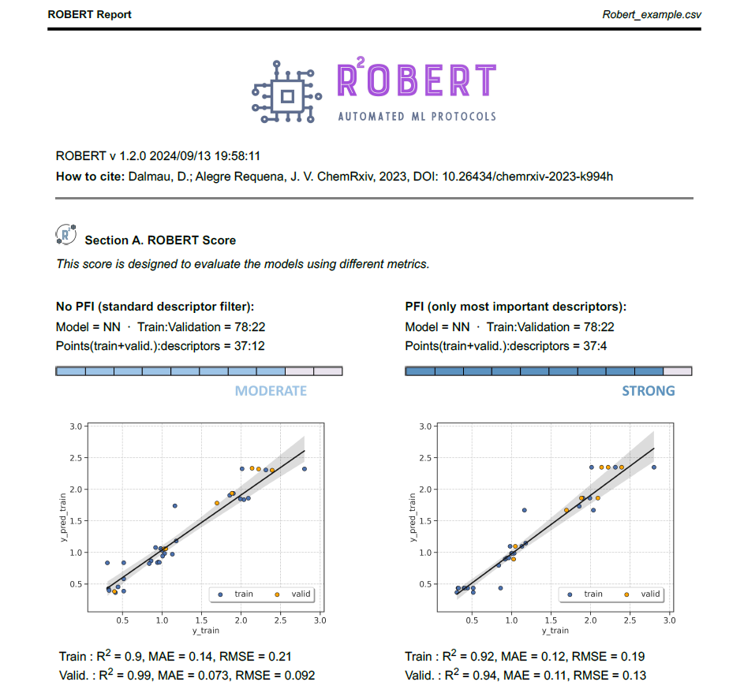

Full workflow from CSV
======================

Overview
++++++++

.. |fullworkflow_fig| image:: ../../Modules/images/FullWorkflow.jpg
   :width: 600

.. centered:: |fullworkflow_fig|

Required inputs
+++++++++++++++

.. |csv_FW| image:: ../images/csv_icon.jpg
   :target: ../../_static/Robert_example.csv
   :width: 30

* **Robert_example.csv:** CSV file with data to use as the training and validation sets. The full CSV file can be 
  found in the `"Examples" folder of the ROBERT repository <https://github.com/jvalegre/robert/tree/master/Examples/CSV_workflow>`__ 
  or downloaded here: |csv_FW|

.. csv-table:: 
   :file: CSV/Robert_example.csv
   :header-rows: 1

Executing the job
+++++++++++++++++

**Instructions:**

1. Download the **Robert_example.csv** file specified in Required inputs.
2. Go to the folder containing the CSV file in your terminal (using the "cd" command, i.e. :code:`cd C:/Users/test_robert`).
3. Activate the conda environment where ROBERT was installed (:code:`conda activate robert`).
4. Run the following command line:

.. code:: shell

   python -m robert --names Name --y Target_values --csv_name Robert_example.csv

**Options used:**

* :code:`--names Name`: Name of the column containing the names of the datapoints. This feature allows to print the names of the outlier points (if any).  

* :code:`--y Target_values`: Name of the column containing the response y values.  

* :code:`--csv_name Robert_example.csv`: CSV with the database.   

Execution time and versions
+++++++++++++++++++++++++++

Time: ~3.5 min

System: 8 processors (11th Gen Intel(R) Core(TM) i7-1165G7 @ 2.80GHz) using 16.0 GB RAM memory

ROBERT version: 2.0.1

scikit-learn-intelex version: 2025.2.0

Results
+++++++

.. |pdf_report_test| image:: ../images/pdf_icon.jpg
   :target: ../../_static/ROBERT_report.pdf
   :width: 30

A PDF file called **ROBERT_report.pdf** should be created in the folder where ROBERT was executed. The PDF file can be visualized here: |pdf_report_test|

The PDF report contains all the results of the workflow. In this case, two Neural Network (NN) models were the optimal model found from: 

   * Four different models (Gradient Boosting GB, MultiVariate Linear MVL, Neural Network NN, Random Forest RF) 

The first part of the PDF file is shown below as a preview:

|pdf_preview|