Full workflow from CSV
======================

Overview
++++++++

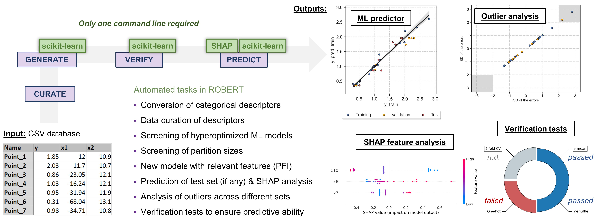

.. centered:: |fullworkflow_fig|

Required inputs
+++++++++++++++

* **Robert_example.csv:** CSV file with data to use as the training and validation sets. The full CSV file can be 
  found in the `"Examples" folder of the ROBERT repository <https://github.com/jvalegre/robert/tree/master/Examples/CSV_workflow>`__ 
  or downloaded here: |csv_FW|

.. csv-table:: 
   :file: CSV/Robert_example.csv
   :header-rows: 1

Executing the job
+++++++++++++++++

**Instructions:**

1. Download the **Robert_example.csv** file specified in Required inputs.
2. Go to the folder containing the CSV file in your terminal (using the "cd" command, i.e. :code:`cd C:/Users/test_robert`).
3. Activate the conda environment where ROBERT was installed (:code:`conda activate robert`).
4. Run the following command line:

.. code:: shell

   python -m robert --ignore "[Name]" --names Name --y Target_values --csv_name Robert_example.csv

**Options used:**

* :code:`--ignore "[Name]"`: Variables ignored in the model. In this case, the column 'Name' that contains the names of the datapoints, which is not included in the model. Quotation marks are included in "[Name]" to avoid problems when using lists in the command line. More variables can be incuded as "[VAR1,VAR2,VAR3...]". 

* :code:`--names Name`: Name of the column containing the names of the datapoints. This feature allows to print the names of the outlier points (if any).  

* :code:`--y Target_values`: Name of the column containing the response y values.  

* :code:`--csv_name Robert_example.csv`: CSV with the database.   

Execution time
++++++++++++++

Time: ~3 min

System: 4 processors (Intel Xeon Ice Lake 8352Y) using 8.0 GB RAM memory

Results
+++++++

A PDF file called **ROBERT_report.pdf** should be created in the folder where ROBERT was executed. The PDF file can be visualized here: |pdf_report_test|

The PDF report contains all the results of the workflow. In this case, a Neural Network (NN) model with 80% training size was the optimal model found from: 

   * Four different models (Gradient Boosting GB, MultiVariate Linear MVL, Neural Network NN, Random Forest RF) 
   * Three different partition sizes (60%, 70%, 80%) 

All the results are summarized below:

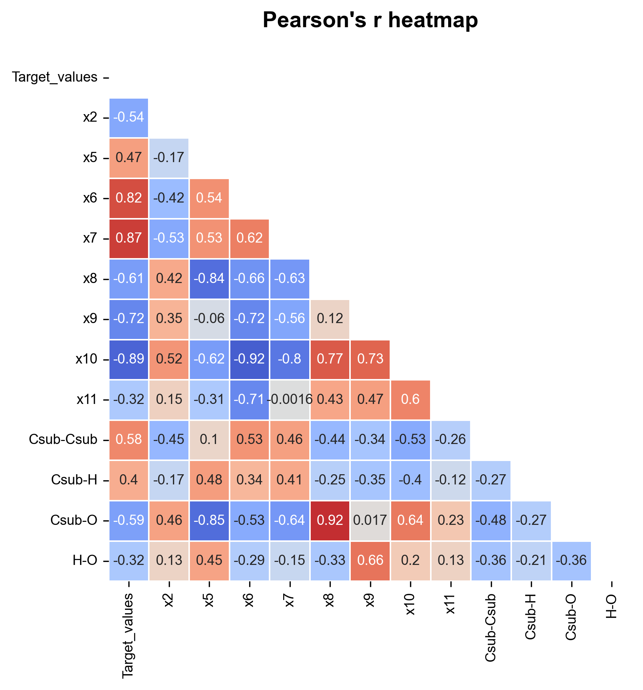

.. |heatmap_no_pfi| image:: ../images/FW/heatmap_no_pfi.png
   :width: 400

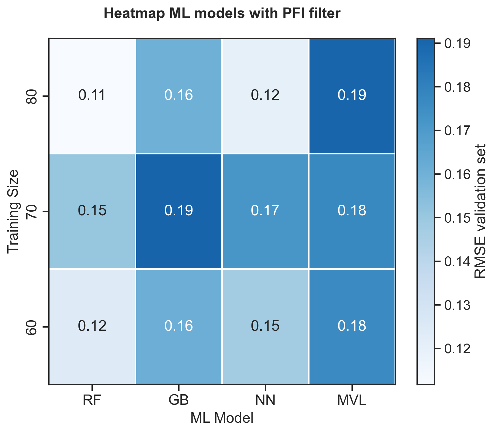

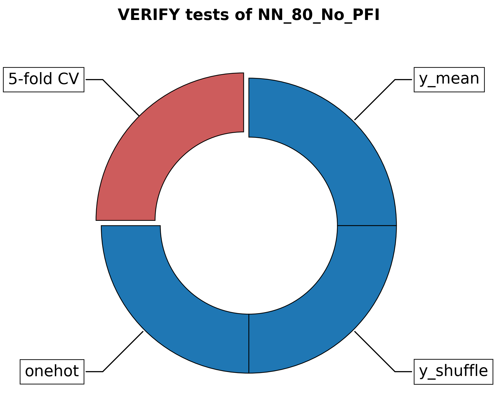

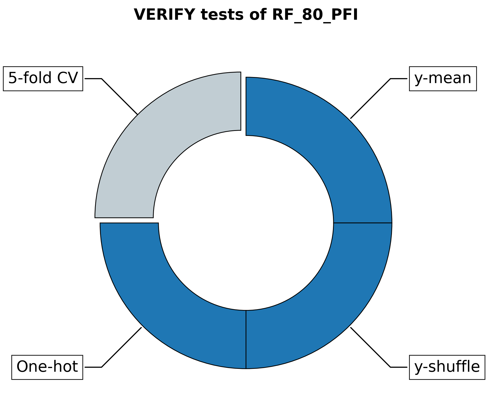

.. |PREDICT_graph_no_pfi| image:: ../images/FW/PREDICT_graph_no_pfi.png
   :width: 600

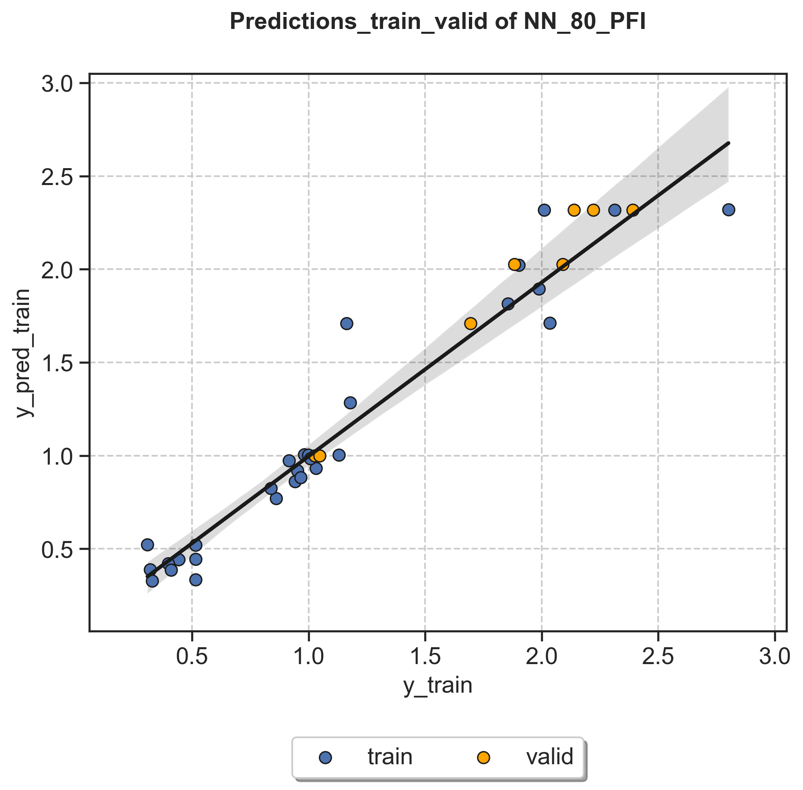

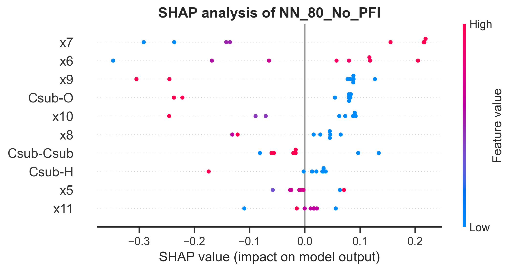

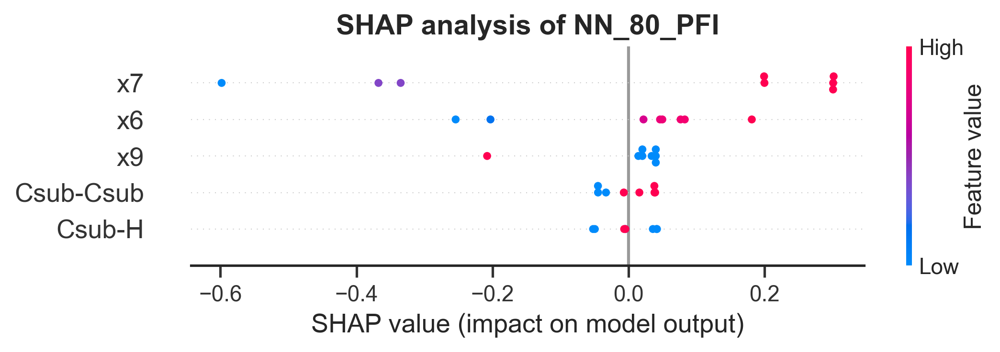

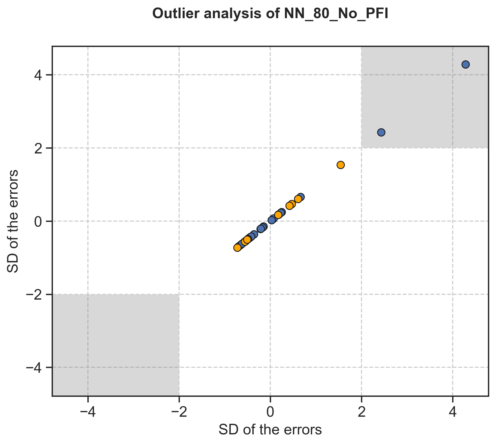

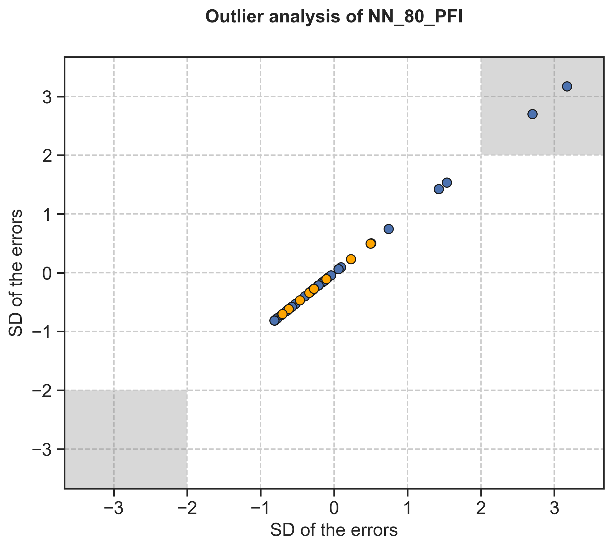

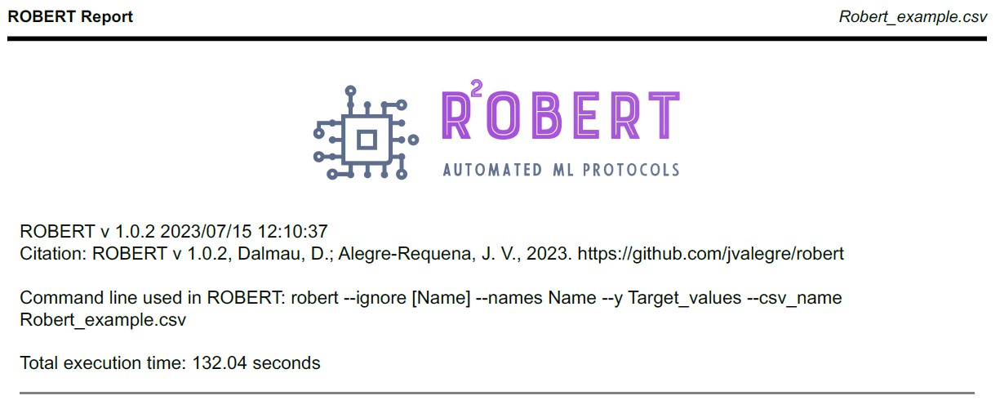

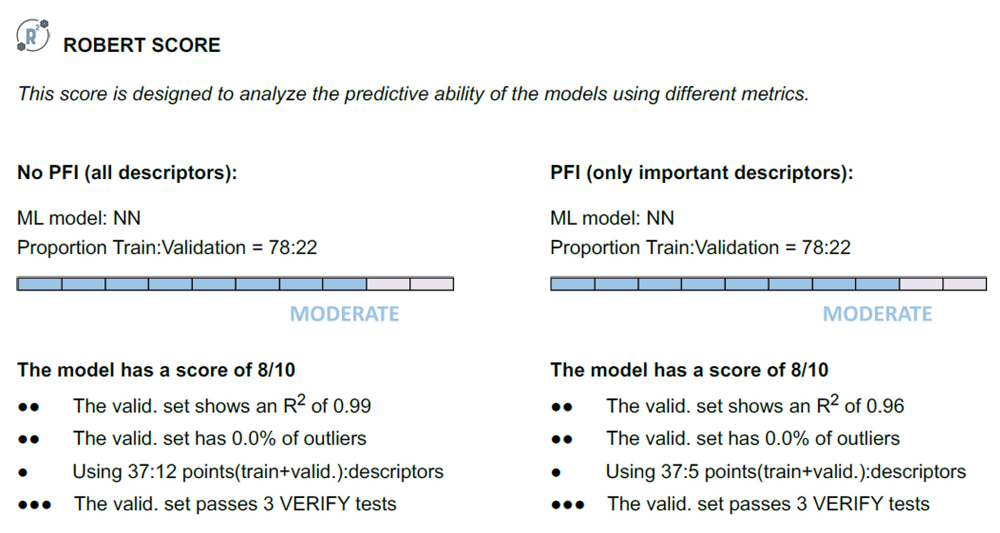

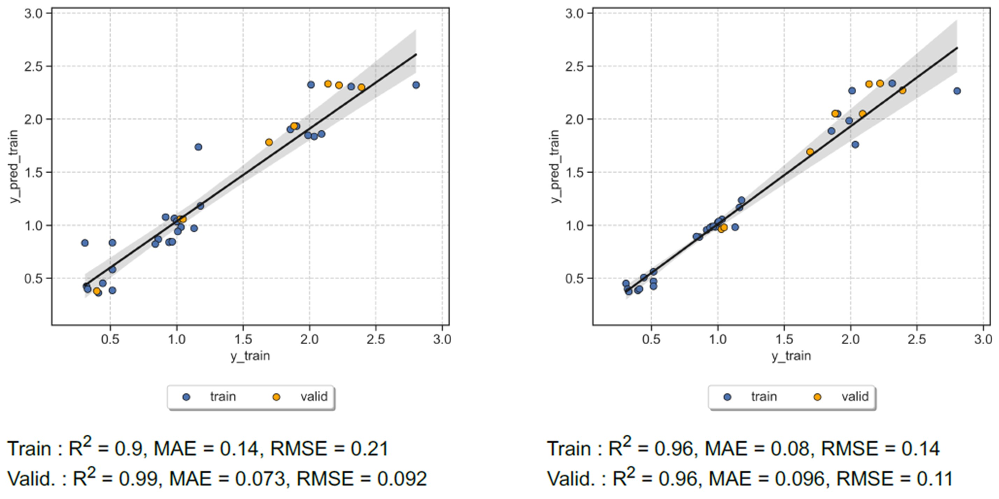

+---------------------------------------------------------------------------------------------------+
|  .. centered:: **SUMMARY OF RESULTS IN THE REPORT AND FOLDERS**                                   |
+---------------------------------------------------------------------------------------------------+
|  |                                                                                                |
|  .. centered:: Header and ROBERT score from the PDF report                                        |
+-------------------------------------------------------------+-------------------------------------+
|  .. centered:: Header                                       |    |header|                         |
+-------------------------------------------------------------+-------------------------------------+
|  .. centered:: ROBERT score                                 |    |score|                          |
+-------------------------------------------------------------+-------------------------------------+
|  .. centered:: Prediction summary                           |    |summary|                        |
+-------------------------------------------------------------+-------------------------------------+
|  |                                                                                                |
|  .. centered:: /CURATE folder                                                                     |
+-------------------------------------------------------------+-------------------------------------+
|  .. centered:: Person_heatmap.png                           |    |Person_heatmap|                 |
+-------------------------------------------------------------+-------------------------------------+
|  |                                                                                                |
|  .. centered:: /GENERATE folder                                                                   |
+-------------------------------------------------------------+-------------------------------------+
|  .. centered:: Heatmap_ML_models_no                         |    |heatmap_no_pfi|                 |
|  .. centered:: _PFI_filter.png                              |                                     |
+-------------------------------------------------------------+-------------------------------------+
|  .. centered:: Heatmap_ML_models_with                       |    |heatmap_pfi|                    |
|  .. centered:: _PFI_filter.png                              |                                     |
+-------------------------------------------------------------+-------------------------------------+
|  |                                                                                                |
|  .. centered:: /VERIFY folder                                                                     |
+-------------------------------------------------------------+-------------------------------------+
|  .. centered:: VERIFY_tests_NN_80_No_PFI.png                |    |VERIFY_no_pfi|                  |
|  .. centered:: *(using 12 descriptors)*                     |                                     |
+-------------------------------------------------------------+-------------------------------------+
|  .. centered:: VERIFY_tests_NN_80_PFI.png                   |    |VERIFY_pfi|                     |
|  .. centered:: *(PFI filter applied, using 5 descriptors)*  |                                     |
+-------------------------------------------------------------+-------------------------------------+
|  |                                                                                                |
|  .. centered:: /PREDICT folder                                                                    |
+-------------------------------------------------------------+-------------------------------------+
|  .. centered:: Results_NN_80_No_PFI.png                     |    |PREDICT_graph_no_pfi|           |
|  .. centered:: *(using 12 descriptors)*                     |                                     |
+-------------------------------------------------------------+-------------------------------------+
|  .. centered:: SHAP_NN_80_No_PFI.png                        |    |PREDICT_shap_no_pfi|            |
|  .. centered:: *(using 12 descriptors)*                     |                                     |
+-------------------------------------------------------------+-------------------------------------+
|  .. centered:: Outliers_NN_80_No_PFI.png                    |    |PREDICT_out_no_pfi|             |
|  .. centered:: *(using 12 descriptors)*                     |                                     |
+-------------------------------------------------------------+-------------------------------------+
|  .. centered:: Results_NN_80_PFI.png                        |    |PREDICT_graph_pfi|              |
|  .. centered:: *(PFI filter applied, using 5 descriptors)*  |                                     |
+-------------------------------------------------------------+-------------------------------------+
|  .. centered:: SHAP_NN_80_PFI.png                           |    |PREDICT_shap_pfi|               |
|  .. centered:: *(PFI filter applied, using 5 descriptors)*  |                                     |
+-------------------------------------------------------------+-------------------------------------+
|  .. centered:: Outliers_NN_80_PFI.png                       |    |PREDICT_out_pfi|                |
|  .. centered:: *(PFI filter applied, using 5 descriptors)*  |                                     |
+-------------------------------------------------------------+-------------------------------------+
