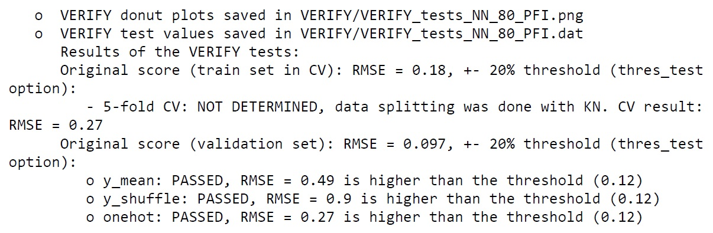
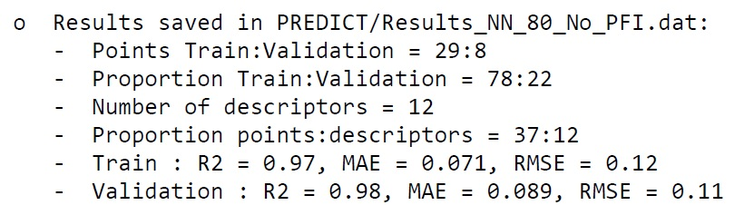
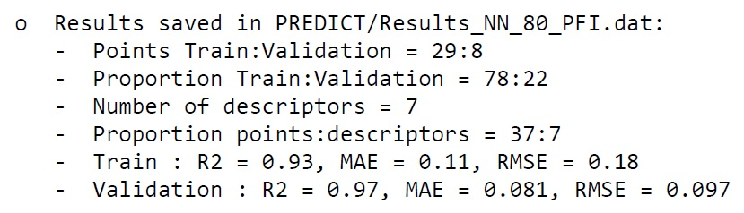
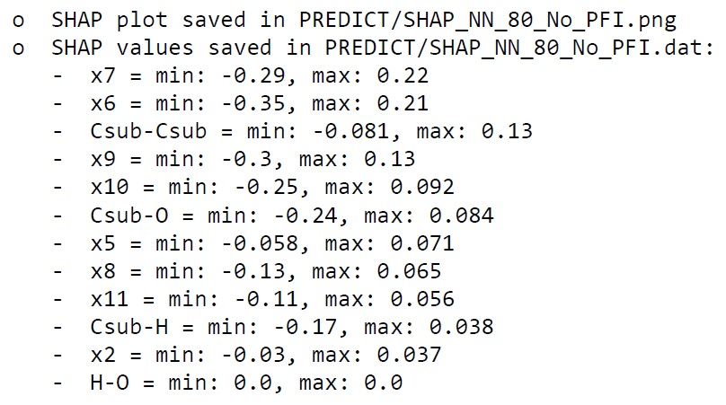
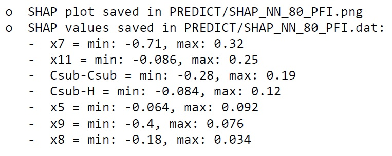
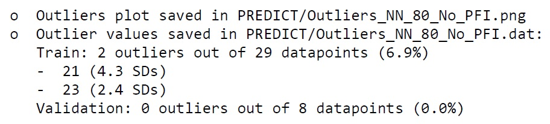
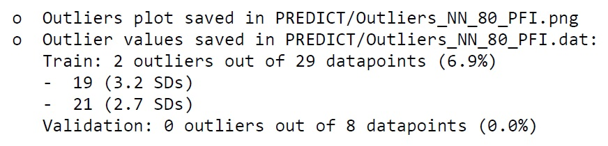

Full workflow from CSV
======================

Required inputs
+++++++++++++++

* **Robert_example.csv:** CSV file with data to use as the training and validation sets. The full CSV file can be found in the `Examples folder of the ROBERT repository <https://github.com/jvalegre/robert/tree/master/Examples/CSV_workflow>`__.

.. csv-table:: 
   :file: CSV/Robert_example.csv
   :header-rows: 1

Executing the job
+++++++++++++++++

**Instructions:**

1. First, go to the folder containing the CSV files in your terminal.
2. Run the following command line:

.. code:: shell

    python -m robert --ignore "[Name]" --names Name --y Target_values --csv_name Robert_example.csv

**Options used:**

* :code:`--ignore "[Name]"`: Variables ignored in the model. In this case, the column 'Name' that contains the names of the datapoints, which is not included in the model. Quotation marks are included in "[Name]" to avoid problems when using lists in the command line. More variables can be incuded as "[VAR1,VAR2,VAR3...]". 

* :code:`--names Name`: Name of the column containing the names of the datapoints. This is an optional feature that allows to print the names of the outlier points.  

* :code:`--y Target_values`: Name of the column containing the response y values.  

* :code:`--csv_name Robert_example.csv`: CSV with the training and validation sets.  

Execution time
++++++++++++++

Time: ~2 min
System: 8 processors (11th Gen Intel(R) Core(TM) i7-1165G7 @ 2.80GHz) with 32.0 GB RAM memory

Results
+++++++

.. |pdf_report_test| image:: ../images/pdf_icon.jpg
   :target: ../../_static/ROBERT_report.pdf
   :width: 30

A PDF file called ROBERT_report.pdf should be created in the folder where ROBERT was executed. The PDF 
file can be visualized here: |pdf_report_test|

The PDF report contains all the results of the workflow. In this case, a Neural Network (NN) model with 80% of the data used as the training set was the optimal model found from the combinations of four different models (Gradient Boosting GB, MultiVariate Linear MVL, Neural Network NN, Random Forest RF) with four different partition sizes (60%, 70%, 80%, 90%). This information is summarized below:

.. |CURATE_data| image:: ../images/FW/CURATE_data.jpg
   :width: 600

.. |Person_heatmap| image:: ../images/FW/Pearson_heatmap.png
   :width: 400

.. |GENERATE_data| image:: ../images/FW/GENERATE_data.jpg
   :width: 600

.. |heatmap_no_pfi| image:: ../images/FW/heatmap_no_pfi.png
   :width: 400

.. |heatmap_pfi| image:: ../images/FW/heatmap_pfi.png
   :width: 400

.. |VERIFY_dat_no_pfi| image:: ../images/FW/VERIFY_dat_no_pfi.jpg
   :width: 600

.. |VERIFY_no_pfi| image:: ../images/FW/VERIFY_no_pfi.png
   :width: 600

.. |VERIFY_pfi| image:: ../images/FW/VERIFY_pfi.png
   :width: 600

.. |PREDICT_graph_no_pfi| image:: ../images/FW/PREDICT_graph_no_pfi.png
   :width: 600

.. |PREDICT_graph_pfi| image:: ../images/FW/PREDICT_graph_pfi.png
   :width: 600

.. |PREDICT_shap_no_pfi| image:: ../images/FW/PREDICT_shap_no_pfi.png
   :width: 600

.. |PREDICT_shap_pfi| image:: ../images/FW/PREDICT_shap_pfi.png
   :width: 600

.. |PREDICT_out_no_pfi| image:: ../images/FW/PREDICT_out_no_pfi.png
   :width: 600

.. |PREDICT_out_pfi| image:: ../images/FW/PREDICT_out_pfi.png
   :width: 600

+---------------------------------------------------------------------------------------------------+
|                                                                                                   |
|                         .. centered:: **RESULTS**                                                 |
|                                                                                                   |
+---------------------------------------------------------------------------------------------------+
|            |                                                                                      |
|  .. centered:: /CURATE folder                                                                     |
|                                                                                                   |
+-------------------------------------------------------------+-------------------------------------+
|  .. centered:: CURATE_data.dat                              |    |CURATE_data|                    |
+-------------------------------------------------------------+-------------------------------------+
|  .. centered:: Person_heatmap.png                           |    |Person_heatmap|                 |
+-------------------------------------------------------------+-------------------------------------+
|            |                                                                                      |
|  .. centered:: /GENERATE folder                                                                   |
|                                                                                                   |
+-------------------------------------------------------------+-------------------------------------+
|  .. centered:: GENERATE_data.dat                            |    |GENERATE_data|                  |
+-------------------------------------------------------------+-------------------------------------+
|  .. centered:: Heatmap ML models no                         |    |heatmap_no_pfi|                 |
|  .. centered:: PFI filter.png                               |                                     |
+-------------------------------------------------------------+-------------------------------------+
|  .. centered:: Heatmap ML models with                       |    |heatmap_pfi|                    |
|  .. centered:: PFI filter.png                               |                                     |
+-------------------------------------------------------------+-------------------------------------+
|            |                                                                                      |
|  .. centered:: /VERIFY folder                                                                     |
|                                                                                                   |
+-------------------------------------------------------------+-------------------------------------+
|  .. centered:: VERIFY_tests_NN_80_No_PFI.dat                |    |VERIFY_dat_no_pfi|              |
|  .. centered:: *(using 12 descriptors)*                     |                                     |
+-------------------------------------------------------------+-------------------------------------+
|  .. centered:: VERIFY_tests_NN_80_No_PFI.png                |    |VERIFY_no_pfi|                  |
|  .. centered:: *(using 12 descriptors)*                     |                                     |
+-------------------------------------------------------------+-------------------------------------+
|  .. centered:: VERIFY_tests_NN_80_PFI.dat                   |    |VERIFY_dat_pfi|                 |
|  .. centered:: *(PFI filter applied, using 7 descriptors)*  |                                     |
+-------------------------------------------------------------+-------------------------------------+
|  .. centered:: VERIFY_tests_NN_80_PFI.png                   |    |VERIFY_pfi|                     |
|  .. centered:: *(PFI filter applied, using 7 descriptors)*  |                                     |
+-------------------------------------------------------------+-------------------------------------+
|            |                                                                                      |
|  .. centered:: /PREDICT folder                                                                    |
|                                                                                                   |
+-------------------------------------------------------------+-------------------------------------+
|  .. centered:: Results_NN_80_No_PFI.dat                     |    |PREDICT_res_no_pfi|             |
|  .. centered:: *(using 12 descriptors)*                     |                                     |
+-------------------------------------------------------------+-------------------------------------+
|  .. centered:: Results_NN_80_No_PFI.png                     |    |PREDICT_graph_no_pfi|           |
|  .. centered:: *(using 12 descriptors)*                     |                                     |
+-------------------------------------------------------------+-------------------------------------+
|  .. centered:: SHAP_NN_80_No_PFI.dat                        |    |PREDICT_shap_dat_no_pfi|        |
|  .. centered:: *(using 12 descriptors)*                     |                                     |
+-------------------------------------------------------------+-------------------------------------+
|  .. centered:: SHAP_NN_80_No_PFI.png                        |    |PREDICT_shap_no_pfi|            |
|  .. centered:: *(using 12 descriptors)*                     |                                     |
+-------------------------------------------------------------+-------------------------------------+
|  .. centered:: Outliers_NN_80_No_PFI.dat                    |    |PREDICT_out_dat_no_pfi|         |
|  .. centered:: *(using 12 descriptors)*                     |                                     |
+-------------------------------------------------------------+-------------------------------------+
|  .. centered:: Outliers_NN_80_No_PFI.png                    |    |PREDICT_out_no_pfi|             |
|  .. centered:: *(using 12 descriptors)*                     |                                     |
+-------------------------------------------------------------+-------------------------------------+
|  .. centered:: Results_NN_80_PFI.dat                        |    |PREDICT_res_pfi|                |
|  .. centered:: *(PFI filter applied, using 7 descriptors)*  |                                     |
+-------------------------------------------------------------+-------------------------------------+
|  .. centered:: Results_NN_80_PFI.png                        |    |PREDICT_graph_pfi|              |
|  .. centered:: *(PFI filter applied, using 7 descriptors)*  |                                     |
+-------------------------------------------------------------+-------------------------------------+
|  .. centered:: SHAP_NN_80_PFI.dat                           |    |PREDICT_shap_dat_pfi|           |
|  .. centered:: *(PFI filter applied, using 7 descriptors)*  |                                     |
+-------------------------------------------------------------+-------------------------------------+
|  .. centered:: SHAP_NN_80_PFI.png                           |    |PREDICT_shap_pfi|               |
|  .. centered:: *(PFI filter applied, using 7 descriptors)*  |                                     |
+-------------------------------------------------------------+-------------------------------------+
|  .. centered:: Outliers_NN_80_PFI.dat                       |    |PREDICT_out_dat_pfi|            |
|  .. centered:: *(PFI filter applied, using 7 descriptors)*  |                                     |
+-------------------------------------------------------------+-------------------------------------+
|  .. centered:: Outliers_NN_80_PFI.png                       |    |PREDICT_out_pfi|                |
|  .. centered:: *(PFI filter applied, using 7 descriptors)*  |                                     |
+-------------------------------------------------------------+-------------------------------------+

