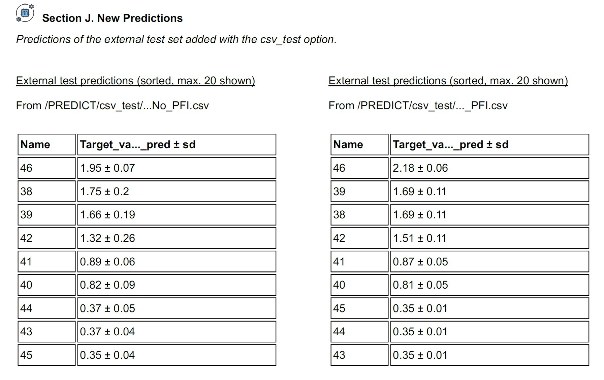

New predictions
===============

Required inputs
+++++++++++++++

.. |csv_FW_test| image:: ../images/csv_icon.jpg
   :target: ../../_static/Robert_example_test.csv
   :width: 30

* **Robert_example_test.csv:** CSV file with data to use as the external test set. The full CSV file can be 
  found in the `"Examples" folder of the ROBERT repository <https://github.com/jvalegre/robert/tree/master/Examples/CSV_workflow>`__ 
  or downloaded here: |csv_FW_test|

.. csv-table:: 
   :file: CSV/Robert_example_test.csv
   :header-rows: 1

Executing the job
+++++++++++++++++

**Instructions:**

1. Run the **Full workflow from CSV** workflow from the Examples.
2. Download the **Robert_example_test.csv** file specified in Required inputs and paste it in the same working folder.
3. Go to the working folder in your terminal (using the "cd" command, i.e. :code:`cd C:/Users/test_robert`).
4. Activate the conda environment where ROBERT was installed (:code:`conda activate robert`).
5. Run the following command line:

.. code:: shell

    python -m robert --predict --csv_test Robert_example_test.csv

.. note:: 

   The --csv_test option can be used as part of end-to-end workflows. For example, this option can be added
   to the "Full workflow from CSV" example:
   
   :code:`python -m robert --names Name --y Target_values --csv_name Robert_example.csv --csv_test Robert_example_test.csv`

**Options used:**

* :code:`--predict`: only runs the PREDICT module.  

* :code:`--names Name`: Name of the column containing the names of the datapoints. This feature allows to print the names of the outlier points (if any).  

* :code:`--csv_test Robert_example_test.csv`: CSV with the external test set.  

Execution time and versions
+++++++++++++++++++++++++++

Time: ~10 sec

System: 8 processors (11th Gen Intel(R) Core(TM) i7-1165G7 @ 2.80GHz) using 16.0 GB RAM memory

ROBERT version: 2.0.1

scikit-learn-intelex version: 2025.2.0

Results
+++++++

.. |csv_no_pfi| image:: ../images/csv_icon.jpg
   :target: ../../_static/Robert_example_test_NN_No_PFI.csv
   :width: 30

.. |csv_pfi| image:: ../images/csv_icon.jpg
   :target: ../../_static/Robert_example_test_NN_PFI.csv
   :width: 30

Two CSV files called **Robert_example_test_NN_No_PFI** and **Robert_example_test_NN_PFI** should be created inside the PREDICT folder. The two files 
contain the predictions from the two different Neural Network (NN) models, with and without PFI filtering,
obtained in the Full workflow example.

The CSV files can be visualized here: |csv_no_pfi| (No PFI), |csv_pfi| (PFI)

If you want to tabulate your results inside a report PDF, run this command line:

.. code:: shell

    python -m robert --report

.. |pdf_report_test| image:: ../images/pdf_icon.jpg
   :target: ../../_static/predictions_report.pdf
   :width: 30

The PDF file can be visualized here: |pdf_report_test|

The predictions are sorted at the end of the PDF report (including both the No_PFI and the PFI models):

.. centered:: |predictions_fig|

