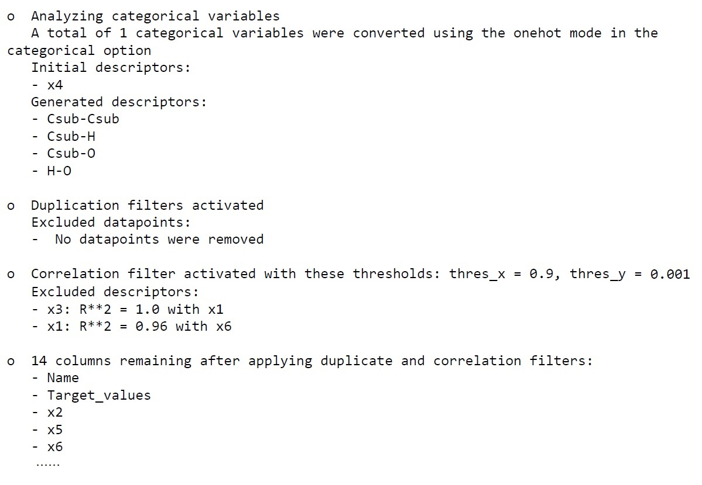
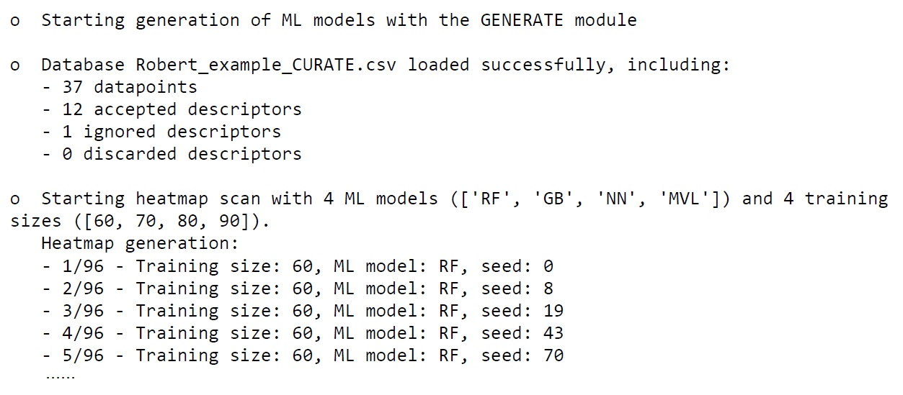
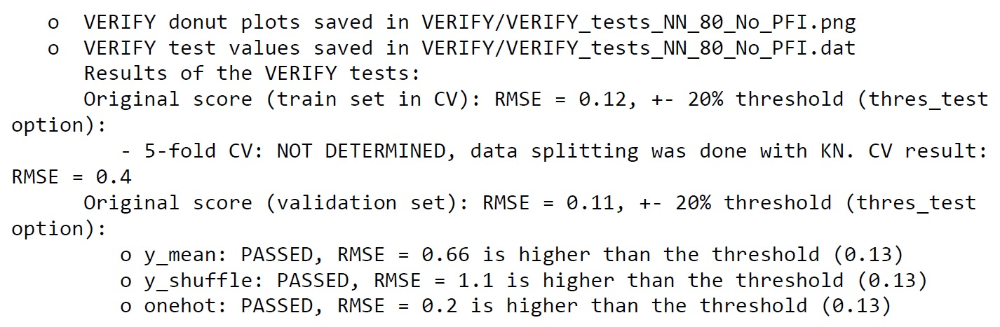
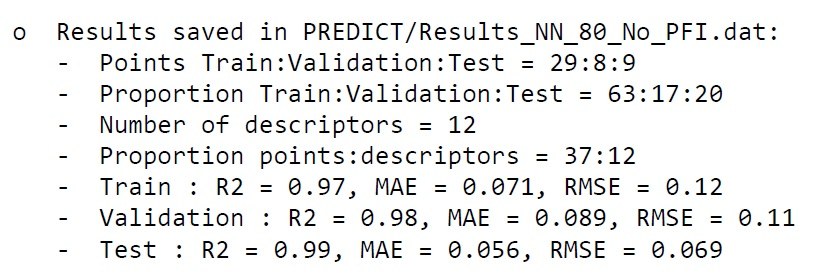
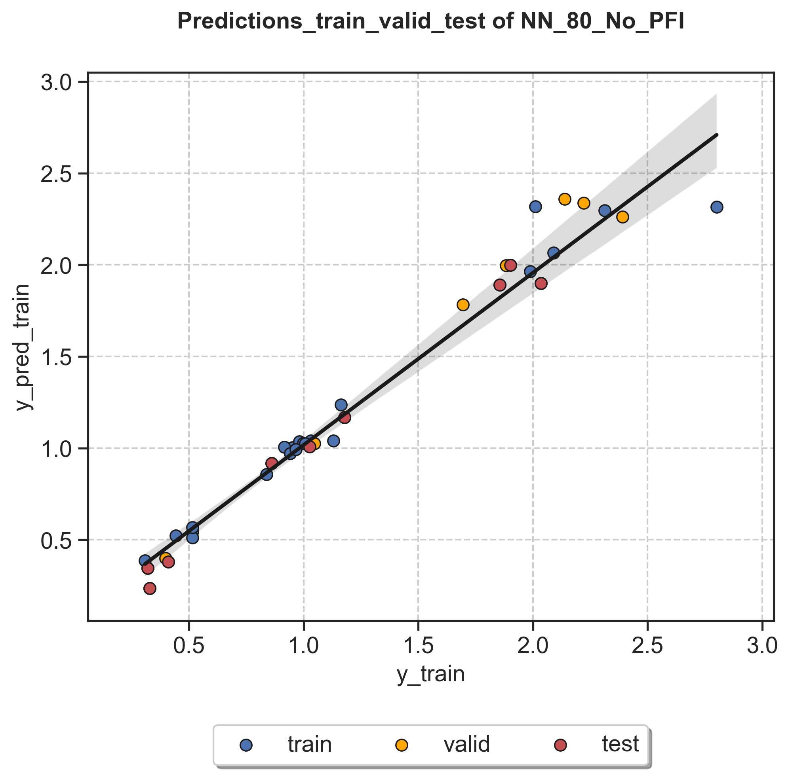
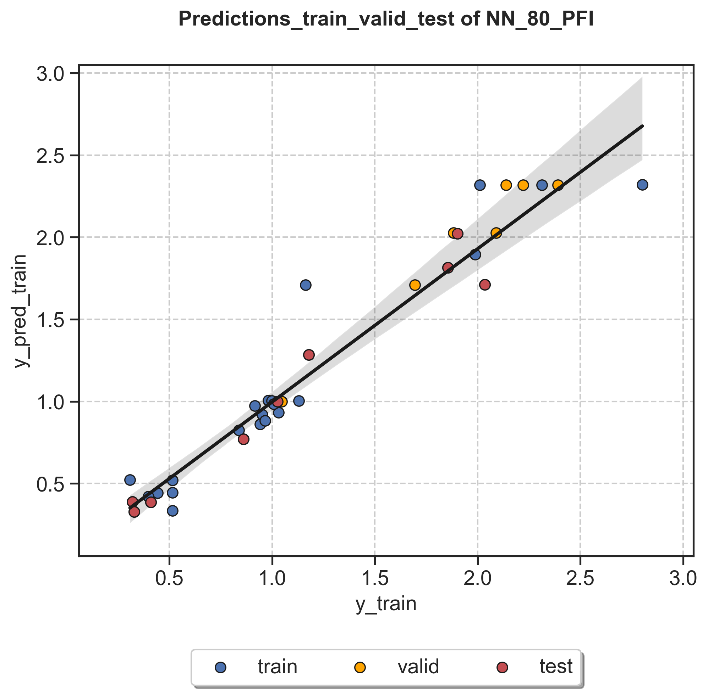
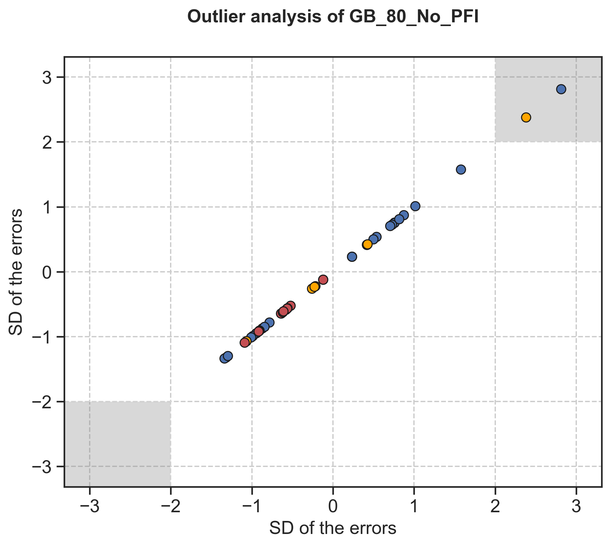
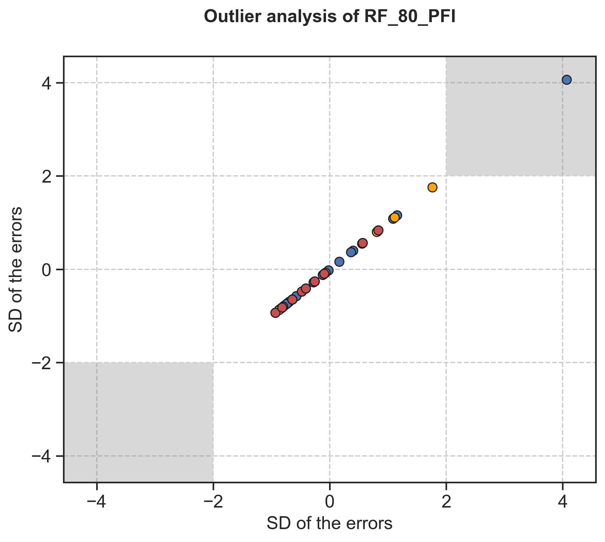
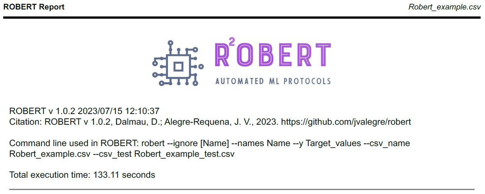

Full workflow from CSV with test set
====================================

Required inputs
+++++++++++++++

* **Robert_example.csv:** CSV file with data to use as the training and validation sets. The full CSV file can be found in the `Examples folder of the ROBERT repository <https://github.com/jvalegre/robert/tree/master/Examples/CSV_workflow>`__.

.. csv-table:: 
   :file: CSV/Robert_example.csv
   :header-rows: 1

* **Robert_example_test.csv:** CSV file with data to use as the external test set. The full CSV file can be found in the `Examples folder of the ROBERT repository <https://github.com/jvalegre/robert/tree/master/Examples/CSV_workflow>`__.

.. csv-table:: 
   :file: CSV/Robert_example_test.csv
   :header-rows: 1

Executing the job
+++++++++++++++++

**Instructions:**

1. First, go to the folder containing the CSV files in your terminal.
2. Run the following command line:

.. code:: shell

    python -m robert --ignore "[Name]" --names Name --y Target_values --csv_name Robert_example.csv --csv_test Robert_example_test.csv

**Options used:**

* :code:`--ignore "[Name]"`: Variables ignored in the model. In this case, the column 'Name' that contains the names of the datapoints, which is not included in the model. Quotation marks are included in "[Name]" to avoid problems when using lists in the command line. More variables can be incuded as "[VAR1,VAR2,VAR3...]". 

* :code:`--names Name`: Name of the column containing the names of the datapoints. This is an optional feature that allows to print the names of the outlier points.  

* :code:`--y Target_values`: Name of the column containing the response y values.  

* :code:`--csv_name Robert_example.csv`: CSV with the training and validation sets.  

* :code:`--csv_test Robert_example_test.csv`: CSV with the external test set.  

Execution time
++++++++++++++

Time: ~2 min

System: 4 processors (Intel Xeon Ice Lake 8352Y) using 8.0 GB RAM memory

Results
+++++++

.. |pdf_report_test| image:: ../images/pdf_icon.jpg
   :target: ../../_static/ROBERT_report_test.pdf
   :width: 30

A PDF file called ROBERT_report.pdf should be created in the folder where ROBERT was executed. The PDF 
file can be visualized here: |pdf_report_test|

The PDF report contains all the results of the workflow. In this case, a Gradient Boosting (GB) and a Random Forest (RF) models with 80% training size were the optimal models found from: 

  * Four different models (Gradient Boosting GB, MultiVariate Linear MVL, Neural Network NN, Random Forest RF) 
  * Three different partition sizes (60%, 70%, 80%) 

All the results are summarized below:

.. |Person_heatmap| image:: ../images/FW/Pearson_heatmap.png
   :width: 400

.. |heatmap_no_pfi| image:: ../images/FW/heatmap_no_pfi.png
   :width: 400

.. |heatmap_pfi| image:: ../images/FW/heatmap_pfi.png
   :width: 400

.. |VERIFY_no_pfi| image:: ../images/FW/VERIFY_no_pfi.png
   :width: 600

.. |VERIFY_pfi| image:: ../images/FW/VERIFY_pfi.png
   :width: 600

.. |PREDICT_shap_no_pfi| image:: ../images/FW/PREDICT_shap_no_pfi.png
   :width: 600

.. |PREDICT_shap_pfi| image:: ../images/FW/PREDICT_shap_pfi.png
   :width: 600

+---------------------------------------------------------------------------------------------------+
|                         .. centered:: **RESULTS**                                                 |
+---------------------------------------------------------------------------------------------------+
|  |                                                                                                |
|  .. centered:: Header of the PDF report                                                           |
+-------------------------------------------------------------+-------------------------------------+
|  .. centered:: Header                                       |    |header|                         |
+-------------------------------------------------------------+-------------------------------------+
|  |                                                                                                |
|  .. centered:: /CURATE folder                                                                     |
+-------------------------------------------------------------+-------------------------------------+
|  .. centered:: CURATE_data.dat                              |    |CURATE_data|                    |
+-------------------------------------------------------------+-------------------------------------+
|  .. centered:: Person_heatmap.png                           |    |Person_heatmap|                 |
+-------------------------------------------------------------+-------------------------------------+
|  |                                                                                                |
|  .. centered:: /GENERATE folder                                                                   |
+-------------------------------------------------------------+-------------------------------------+
|  .. centered:: GENERATE_data.dat                            |    |GENERATE_data|                  |
+-------------------------------------------------------------+-------------------------------------+
|  .. centered:: Heatmap ML models no                         |    |heatmap_no_pfi|                 |
|  .. centered:: PFI filter.png                               |                                     |
+-------------------------------------------------------------+-------------------------------------+
|  .. centered:: Heatmap ML models with                       |    |heatmap_pfi|                    |
|  .. centered:: PFI filter.png                               |                                     |
+-------------------------------------------------------------+-------------------------------------+
|  |                                                                                                |
|  .. centered:: /VERIFY folder                                                                     |
+-------------------------------------------------------------+-------------------------------------+
|  .. centered:: VERIFY_tests_NN_80_No_PFI.dat                |    |VERIFY_dat_no_pfi|              |
|  .. centered:: *(using 12 descriptors)*                     |                                     |
+-------------------------------------------------------------+-------------------------------------+
|  .. centered:: VERIFY_tests_NN_80_No_PFI.png                |    |VERIFY_no_pfi|                  |
|  .. centered:: *(using 12 descriptors)*                     |                                     |
+-------------------------------------------------------------+-------------------------------------+
|  .. centered:: VERIFY_tests_NN_80_PFI.png                   |    |VERIFY_pfi|                     |
|  .. centered:: *(PFI filter applied, using 4 descriptors)*  |                                     |
+-------------------------------------------------------------+-------------------------------------+
|  |                                                                                                |
|  .. centered:: /PREDICT folder                                                                    |
+-------------------------------------------------------------+-------------------------------------+
|  .. centered:: Results_NN_80_No_PFI.dat                     |    |PREDICT_res_no_pfi|             |
|  .. centered:: *(using 12 descriptors)*                     |                                     |
+-------------------------------------------------------------+-------------------------------------+
|  .. centered:: Results_NN_80_No_PFI.png                     |    |PREDICT_graph_no_pfi|           |
|  .. centered:: *(using 12 descriptors)*                     |                                     |
+-------------------------------------------------------------+-------------------------------------+
|  .. centered:: SHAP_NN_80_No_PFI.png                        |    |PREDICT_shap_no_pfi|            |
|  .. centered:: *(using 12 descriptors)*                     |                                     |
+-------------------------------------------------------------+-------------------------------------+
|  .. centered:: Outliers_NN_80_No_PFI.png                    |    |PREDICT_out_no_pfi|             |
|  .. centered:: *(using 12 descriptors)*                     |                                     |
+-------------------------------------------------------------+-------------------------------------+
|  .. centered:: Results_NN_80_PFI.png                        |    |PREDICT_graph_pfi|              |
|  .. centered:: *(PFI filter applied, using 4 descriptors)*  |                                     |
+-------------------------------------------------------------+-------------------------------------+
|  .. centered:: SHAP_NN_80_PFI.png                           |    |PREDICT_shap_pfi|               |
|  .. centered:: *(PFI filter applied, using 4 descriptors)*  |                                     |
+-------------------------------------------------------------+-------------------------------------+
|  .. centered:: Outliers_NN_80_PFI.png                       |    |PREDICT_out_pfi|                |
|  .. centered:: *(PFI filter applied, using 4 descriptors)*  |                                     |
+-------------------------------------------------------------+-------------------------------------+
