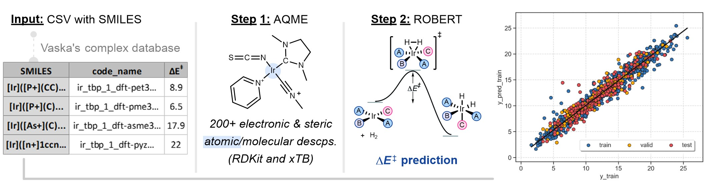
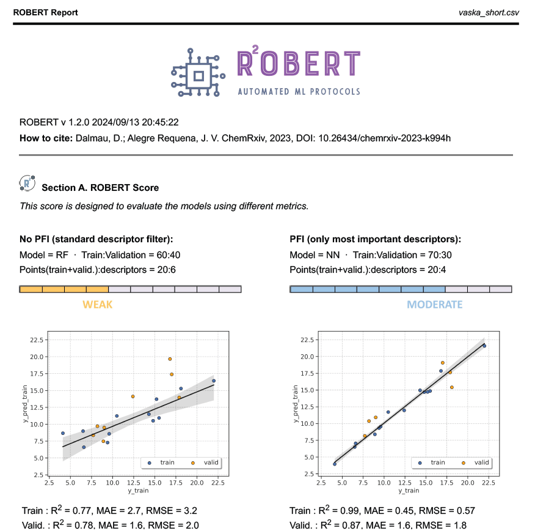

SMILES workflow with atomic properties
======================================

Overview
++++++++

This is a modified version of the workflow used in the ROBERT manuscript for Vaska's catalysts, 
with a smaller database size.

.. centered:: |aqme_fig|

Reproducibility warning
+++++++++++++++++++++++

.. warning::

   **Update to AQME v1.6.0 or higher to obtain fully reproducible results!** You can do it with :code:`pip install aqme --upgrade`.
   Otherwise, it may not be possible to exactly reproduce the results due to subtle differences in the 
   generated xTB descriptors (0.1% changes in most cases).

Required inputs
+++++++++++++++

* **vaska_short.csv:** CSV file with SMILES to generate descriptors that will be used as the training and validation sets. The full CSV file can be downloaded here: |csv_smi|

.. |csv_smi| image:: ../images/csv_icon.jpg
   :target: ../../_static/vaska_short.csv
   :width: 30  

.. csv-table:: 
   :file: CSV/vaska_short.csv
   :header-rows: 1
   :widths: 10, 10, 10, 10, 10, 10, 10

The CSV database contains parameters used in the AQME workflow:

* :code:`code_name`: compound names.  

* :code:`smiles`: SMILES strings of the Ir complexes.  

* :code:`barrier`: activation energy barriers.  

* :code:`charge`: charge of the Ir complexes.  

* :code:`mult`: multiplicity of the Ir complexes.  

* :code:`complex_type`: defines squareplanar geometry during conformer generation.  

* :code:`geom`: filters off conformers based on ligand positions of Ir squareplanar complexes.  

Required packages
+++++++++++++++++

* **AQME:** Install (or update) AQME with conda-forge (or follow the instructions from `their ReadtheDocs <https://aqme.readthedocs.io>`__):

.. code:: shell

    conda install -y -c conda-forge aqme
    pip install aqme --upgrade      (if AQME was previously installed)

* **xTB:** Install xTB with conda-forge (or follow the instructions from `their documentation <https://xtb-docs.readthedocs.io>`__):

.. code:: shell

    conda install -y -c conda-forge xtb

.. warning::

   This workflow is not available in Windows because xTB is **only compatible with macOS and Linux!**

Executing the job
+++++++++++++++++

**Instructions:**

1. Install the programs specified in Required packages.
2. Download the **vaska_short.csv** file specified in Required inputs.
3. Go to the folder containing the CSV file in your terminal (using the "cd" command, i.e. :code:`cd C:/Users/test_robert`).
4. Activate the conda environment where ROBERT was installed (:code:`conda activate robert`).
5. Run the following command line:

.. code:: shell

    python -m robert --aqme --y "barrier" --csv_name "vaska_short.csv" --qdescp_keywords "--qdescp_atoms ['Ir']"

**Options used:**

* :code:`--aqme`: Calls the AQME module to convert SMILES into RDKit and xTB descriptors, retrieving a new CSV database. 

* :code:`--y barrier`: Name of the column containing the response y values.  

* :code:`--csv_name vaska_short.csv`: CSV with the SMILES strings.  

* :code:`--qdescp_keywords "--qdescp_atoms ['Ir']"`: activates the generation of atomic descriptors with xTB using SMARTS patterns.  

.. |br| raw:: html

    

.. note:: 

   In this example, the SMARTS pattern used is 'Ir', which specifies Ir atoms. The program allows 
   the use of multiple SMARTS patterns simultaneously, using commas as separators, and it accepts atoms, 
   bonds, and other structural motifs. For example:

   1.	Atomic descriptors at Zn and Ir centers: :code:`"--qdescp_atoms ['Zn','Ir']"` |br|
   2. At the two C atoms of a triple bond: :code:`"--qdescp_atoms ['C#C']"` |br|
   3.	At the C and Zn atoms from a C-Zn bond: :code:`"--qdescp_atoms ['[C][Zn]']"` |br|
   4.	At the C and Zn atoms from a C-Zn bond, and at the two C atoms of a triple bond: :code:`"--qdescp_atoms ['[C][Zn]','C#C']"` |br|
   5.	At a Zn atom and at the two C atoms of a triple bond: :code:`"--qdescp_atoms ['Zn','C#C']"`

   For more information about SMARTS patterns, follow `this link <https://www.daylight.com/dayhtml/doc/theory/theory.smarts.html>`__.

.. warning::

   When :code:`--qdescp_keywords "--qdescp_atoms ['Ir']"` is used, all the molecules in the database that 
   do not contain Ir atoms will not be included in the workflow. 

By default, the workflow sets:

* :code:`--ignore "[code_name]"` (variables ignored in the model)

* :code:`--discard "[smiles,charge,mult,complex_type,geom]"` (variables discarded after descriptor generation)

* :code:`--names code_name` (name of the column containing the names of the datapoints)  

Execution time and versions
+++++++++++++++++++++++++++

Time: ~3 min

System: 4 processors (Intel Xeon Ice Lake 8352Y) using 8.0 GB RAM memory

ROBERT version: 1.2.1

scikit-learn-intelex version: 2024.5.0

AQME version: 1.6.1

xTB version: 6.6.1

Results
+++++++

**Initial AQME workflow**

.. |csv_report_vaska| image:: ../images/csv_icon.jpg
   :target: ../../_static/AQME-ROBERT_vaska_short.csv
   :width: 30

* The workflow starts with a CSEARCH-RDKit conformer sampling (using RDKit by default, although CREST is also available if :code:`--csearch_keywords "--program crest"` is added).

* Then, QDESCP is used to generate more than 200 RDKit and xTB Boltzmann-averaged molecular descriptors (using xTB geometry optimizations and different single-point calculations).

A CSV file called **AQME-ROBERT_vaska_short.csv** should be created in the folder where ROBERT was executed. The CSV 
file can be downloaded here: |csv_report_vaska|

**Following ROBERT workflow**

.. |pdf_report_vaska| image:: ../images/pdf_icon.jpg
   :target: ../../_static/ROBERT_report_vaska.pdf
   :width: 30

A PDF file called **ROBERT_report.pdf** should be created in the folder where ROBERT was executed. The PDF 
file can be visualized here: |pdf_report_vaska|

The PDF report contains all the results of the workflow. In this case, a Random Forest (RF) model with 60% training size and a Neural Network (NN) with 70% training size were the optimal models found from: 

  * Four different models (Gradient Boosting GB, MultiVariate Linear MVL, Neural Network NN, Random Forest RF) 
  * Two different partition sizes (60%, 70%) 

The first part of the PDF file is shown below as a preview:

|pdf_preview|