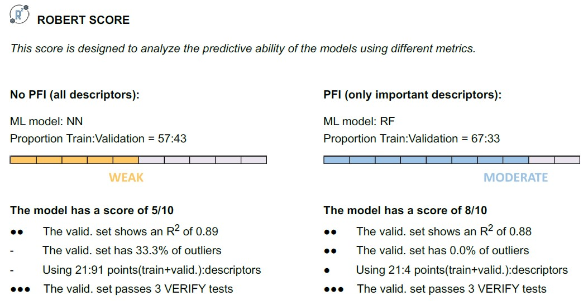
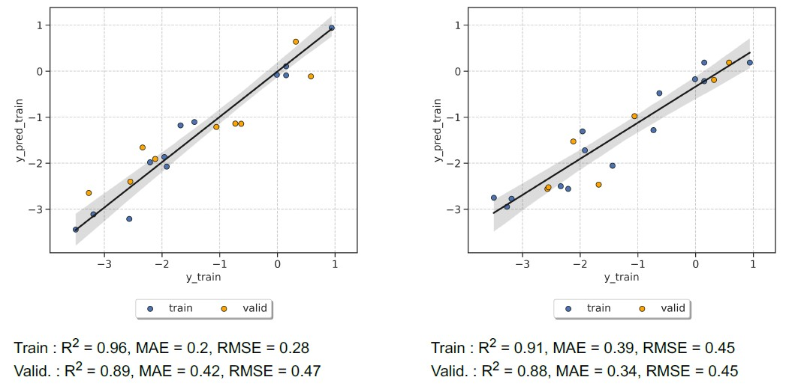

Full workflow from SMILES
=========================

Overview
++++++++

.. |aqme_fig| image:: ../../Modules/images/AQME.jpg
   :width: 600

.. centered:: |aqme_fig|

Reproducibility warning
+++++++++++++++++++++++

.. warning::

   **Update to AQME v1.6.0 or higher to obtain fully reproducible results!** You can do it with :code:`pip install aqme --upgrade`.
   Otherwise, it may not be possible to exactly reproduce the results due to subtle differences in the 
   generated xTB descriptors (0.1% changes in most cases).

Required inputs
+++++++++++++++

* **solubility_short.csv:** CSV file with SMILES to generate descriptors that will be used as the training and validation sets. The full CSV file can be found in the `Examples folder of the ROBERT repository <https://github.com/jvalegre/robert/tree/master/Examples/SMILES_workflow>`__ or downloaded here: |csv_smi|

.. |csv_smi| image:: ../images/csv_icon.jpg
   :target: ../../_static/solubility_short.csv
   :width: 30  

.. csv-table:: 
   :file: CSV/solubility_short.csv
   :header-rows: 1
   :widths: 25, 25, 25

The CSV database contains the following columns:

* :code:`code_name`: compound names.  

* :code:`smiles`: SMILES strings of the compounds.  

* :code:`solubility`: solubility of the compounds.  

Required packages
+++++++++++++++++

* **AQME:** Install (or update) AQME with conda-forge (or follow the instructions from `their ReadtheDocs <https://aqme.readthedocs.io>`__):

.. code:: shell

    conda install -c conda-forge aqme
    pip install aqme --upgrade      (if AQME was previously installed)

* **xTB:** Install xTB with conda-forge (or follow the instructions from `their documentation <https://xtb-docs.readthedocs.io>`__):

.. code:: shell

    conda install -c conda-forge xtb

.. warning::

   This workflow is not available in Windows because xTB is **only compatible with macOS and Linux!**

Executing the job
+++++++++++++++++

**Instructions:**

1. Install the programs specified in Required packages.
2. Download the **solubility_short.csv** file specified in Required inputs.
3. Go to the folder containing the CSV file in your terminal (using the "cd" command, i.e. :code:`cd C:/Users/test_robert`).
4. Activate the conda environment where ROBERT was installed (:code:`conda activate robert`).
5. Run the following command line:

.. code:: shell

    python -m robert --aqme --y solubility --csv_name solubility_short.csv

**Options used:**

* :code:`--aqme`: Calls the AQME module to convert SMILES into RDKit and xTB descriptors, retrieving a new CSV database. 

* :code:`--y solubility`: Name of the column containing the response y values.  

* :code:`--csv_name solubility_short.csv`: CSV with the SMILES strings.  

By default, the workflow sets:

* :code:`--ignore "[code_name]"` (variables ignored in the model)

* :code:`--discard "[smiles]"` (variables discarded after descriptor generation)

* :code:`--names code_name` (name of the column containing the names of the datapoints)  

Execution time
++++++++++++++

Time: ~1.5 min

System: 4 processors (Intel Xeon Ice Lake 8352Y) using 8.0 GB RAM memory

Results
+++++++

**Initial AQME workflow**

.. |csv_report_smi| image:: ../images/csv_icon.jpg
   :target: ../../_static/AQME-ROBERT_solubility_short.csv
   :width: 30

* The workflow starts with a CSEARCH-RDKit conformer sampling (using RDKit by default, although CREST is also available if :code:`--csearch_keywords "--program crest"` is added).

* Then, QDESCP is used to generate more than 200 RDKit and xTB Boltzmann-averaged molecular descriptors (using xTB geometry optimizations and different single-point calculations).

A CSV file called **AQME-ROBERT_solubility_short.csv** should be created in the folder where ROBERT was executed. The CSV 
file can be downloaded here: |csv_report_smi|

**Following ROBERT workflow**

.. |pdf_report_smiles| image:: ../images/pdf_icon.jpg
   :target: ../../_static/ROBERT_report_smiles.pdf
   :width: 30

A PDF file called **ROBERT_report.pdf** should be created in the folder where ROBERT was executed. The PDF 
file can be visualized here: |pdf_report_smiles|

The PDF report contains all the results of the workflow. In this case, a Neural Network (NN) model with 60% training size and a Random Forest (RF) model with 70% training size were the optimal models found from: 

  * Four different models (Gradient Boosting GB, MultiVariate Linear MVL, Neural Network NN, Random Forest RF) 
  * Two different partition sizes (60%, 70%) 

All the results are summarized below:

.. |heatmap_no_pfi| image:: ../images/FW_smiles/heatmap_no_pfi.png
   :width: 400

.. |heatmap_pfi| image:: ../images/FW_smiles/heatmap_pfi.png
   :width: 400

.. |VERIFY_no_pfi| image:: ../images/FW_smiles/VERIFY_no_pfi.png
   :width: 600

.. |VERIFY_pfi| image:: ../images/FW_smiles/VERIFY_pfi.png
   :width: 600

.. |PREDICT_graph_no_pfi| image:: ../images/FW_smiles/PREDICT_graph_no_pfi.png
   :width: 600

.. |PREDICT_graph_pfi| image:: ../images/FW_smiles/PREDICT_graph_pfi.png
   :width: 600

.. |PREDICT_shap_no_pfi| image:: ../images/FW_smiles/PREDICT_shap_no_pfi.png
   :width: 600

.. |PREDICT_shap_pfi| image:: ../images/FW_smiles/PREDICT_shap_pfi.png
   :width: 600

.. |PREDICT_out_no_pfi| image:: ../images/FW_smiles/PREDICT_out_no_pfi.png
   :width: 600

.. |PREDICT_out_pfi| image:: ../images/FW_smiles/PREDICT_out_pfi.png
   :width: 600

.. |header| image:: ../images/FW_smiles/header_smiles.jpg
   :width: 600

+---------------------------------------------------------------------------------------------------+
|                         .. centered:: **RESULTS**                                                 |
+---------------------------------------------------------------------------------------------------+
|  |                                                                                                |
|  .. centered:: Header and ROBERT score from the PDF report                                        |
+-------------------------------------------------------------+-------------------------------------+
|  .. centered:: Header                                       |    |header|                         |
+-------------------------------------------------------------+-------------------------------------+
|  .. centered:: ROBERT score                                 |    |score|                          |
+-------------------------------------------------------------+-------------------------------------+
|  .. centered:: Prediction summary                           |    |summary|                        |
+-------------------------------------------------------------+-------------------------------------+
|  |                                                                                                |
|  .. centered:: /GENERATE folder                                                                   |
+-------------------------------------------------------------+-------------------------------------+
|  .. centered:: Heatmap_ML_models_no                         |    |heatmap_no_pfi|                 |
|  .. centered:: _PFI_filter.png                              |                                     |
+-------------------------------------------------------------+-------------------------------------+
|  .. centered:: Heatmap_ML_models_with                       |    |heatmap_pfi|                    |
|  .. centered:: _PFI_filter.png                              |                                     |
+-------------------------------------------------------------+-------------------------------------+
|  |                                                                                                |
|  .. centered:: /VERIFY folder                                                                     |
+-------------------------------------------------------------+-------------------------------------+
|  .. centered:: VERIFY_tests_NN_60_No_PFI.png                |    |VERIFY_no_pfi|                  |
|  .. centered:: *(using 91 descriptors)*                     |                                     |
+-------------------------------------------------------------+-------------------------------------+
|  .. centered:: VERIFY_tests_RF_70_PFI.png                   |    |VERIFY_pfi|                     |
|  .. centered:: *(PFI filter applied, using 4 descriptors)*  |                                     |
+-------------------------------------------------------------+-------------------------------------+
|  |                                                                                                |
|  .. centered:: /PREDICT folder                                                                    |
+-------------------------------------------------------------+-------------------------------------+
|  .. centered:: Results_NN_60_No_PFI.png                     |    |PREDICT_graph_no_pfi|           |
|  .. centered:: *(using 91 descriptors)*                     |                                     |
+-------------------------------------------------------------+-------------------------------------+
|  .. centered:: SHAP_NN_60_No_PFI.png                        |    |PREDICT_shap_no_pfi|            |
|  .. centered:: *(using 91 descriptors)*                     |                                     |
+-------------------------------------------------------------+-------------------------------------+
|  .. centered:: Outliers_NN_60_No_PFI.png                    |    |PREDICT_out_no_pfi|             |
|  .. centered:: *(using 91 descriptors)*                     |                                     |
+-------------------------------------------------------------+-------------------------------------+
|  .. centered:: Results_RF_70_PFI.png                        |    |PREDICT_graph_pfi|              |
|  .. centered:: *(PFI filter applied, using 4 descriptors)*  |                                     |
+-------------------------------------------------------------+-------------------------------------+
|  .. centered:: SHAP_RF_70_PFI.png                           |    |PREDICT_shap_pfi|               |
|  .. centered:: *(PFI filter applied, using 4 descriptors)*  |                                     |
+-------------------------------------------------------------+-------------------------------------+
|  .. centered:: Outliers_RF_70_PFI.png                       |    |PREDICT_out_pfi|                |
|  .. centered:: *(PFI filter applied, using 4 descriptors)*  |                                     |
+-------------------------------------------------------------+-------------------------------------+
