Full workflow from SMILES
=========================

Required inputs
+++++++++++++++

* **solubility_short.csv:** CSV file with SMILES to generate descriptors that will be used as the training and validation sets. The full CSV file can be found in the `Examples folder of the ROBERT repository <https://github.com/jvalegre/robert/tree/master/Examples/SMILES_workflow>`__.

.. csv-table:: 
   :file: CSV/solubility_short.csv
   :header-rows: 1
   :widths: 25, 25, 25

Executing the job
+++++++++++++++++

**Instructions:**

1. First, go to the folder containing the CSV files in your terminal.
2. Run the following command line:

.. code:: shell

    python -m robert --aqme --y solubility --csv_name solubility_short.csv

**Options used:**

* :code:`--aqme"`: Calls the AQME module to convert SMILES into RDKit and xTB descriptors, retrieving a new CSV database. 

* :code:`--y solubility`: Name of the column containing the response y values.  

* :code:`--csv_name solubility_short.csv`: CSV with the SMILES strings.  

By default, the workflow sets:

  - :code:`--ignore "[code_name,smiles]"` (variables ignored in the model)

  - :code:`--names code_name` (name of the column containing the names of the datapoints)  

Execution time
++++++++++++++

Time: 20 min

System: 4 processors (Intel Xeon Ice Lake 8352Y) using 8.0 GB RAM memory

Results
+++++++

**Initial AQME workflow**

.. |csv_report_test| image:: ../images/csv_icon.jpg
   :target: ../../_static/AQME-ROBERT_solubility_short.csv
   :width: 30

* The workflow starts with a CSEARCH-RDKit conformer sampling:

* Then, QDESCP is used to generate more than 200 RDKit and xTB Boltzmann-averaged molecular descriptors:

A CSV file called AQME-ROBERT_solubility_short.csv should be created in the folder where ROBERT was executed. The CSV 
file can be visualized here: |csv_report_test|

**Following ROBERT workflow**

.. |pdf_report_test| image:: ../images/pdf_icon.jpg
   :target: ../../_static/ROBERT_report_smiles.pdf
   :width: 30

A PDF file called ROBERT_report.pdf should be created in the folder where ROBERT was executed. The PDF 
file can be visualized here: |pdf_report_test|

The PDF report contains all the results of the workflow. In this case, Gradient Boosting (GB) models with 80% and 90% training sizes were the optimal models found from: 

  * Four different models (Gradient Boosting GB, MultiVariate Linear MVL, Neural Network NN, Random Forest RF) 
  * Four different partition sizes (60%, 70%, 80%, 90%) 

All the results are summarized below:

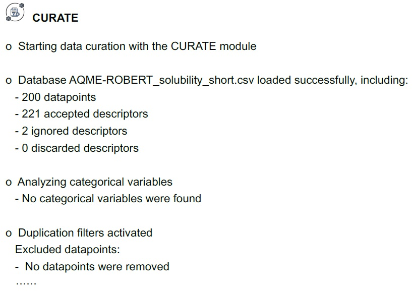

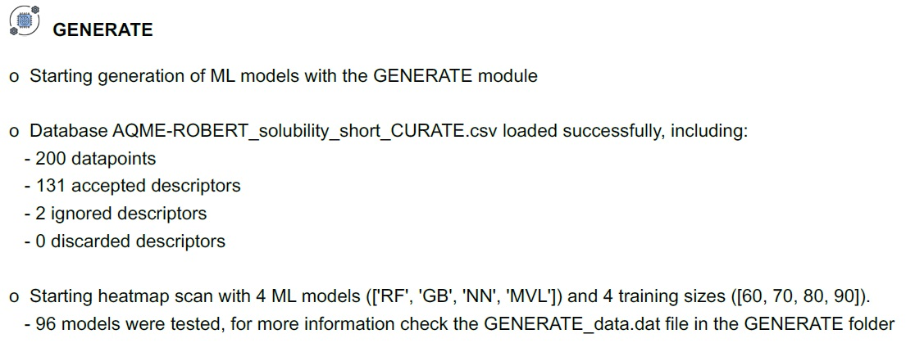

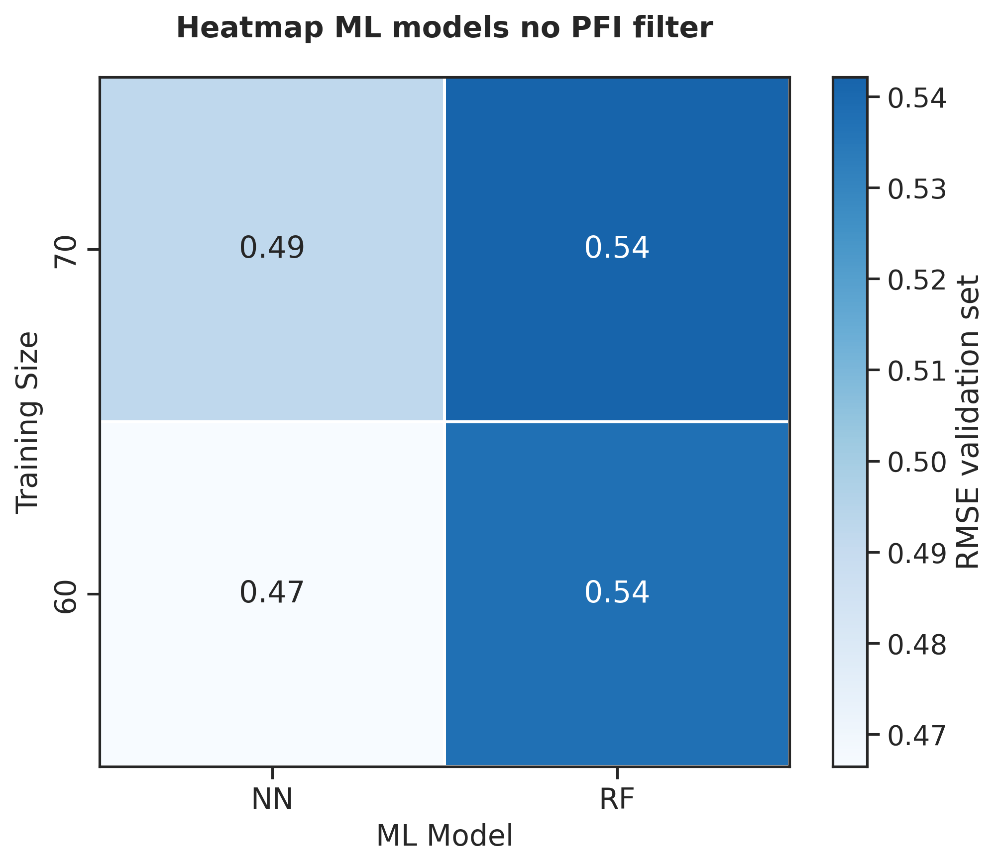

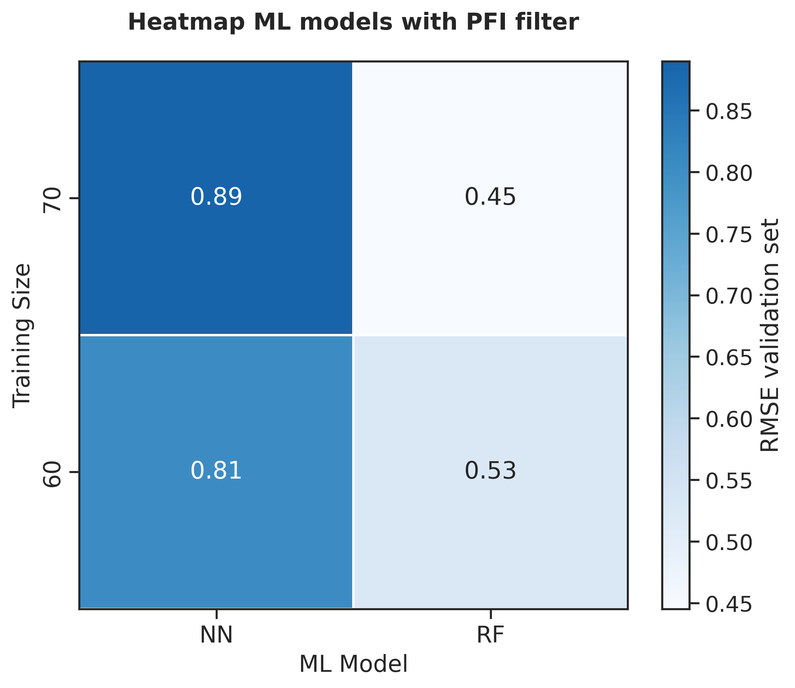

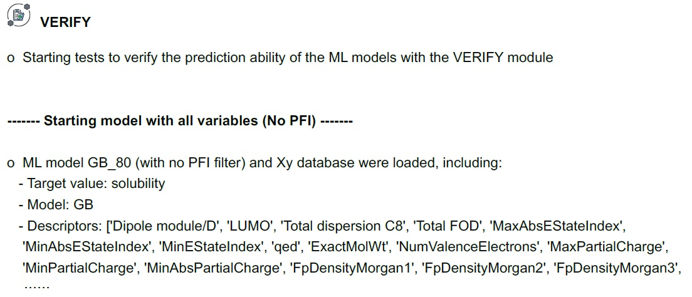

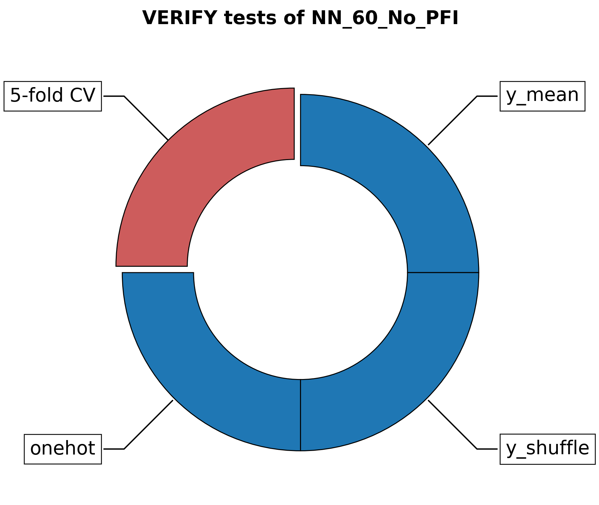

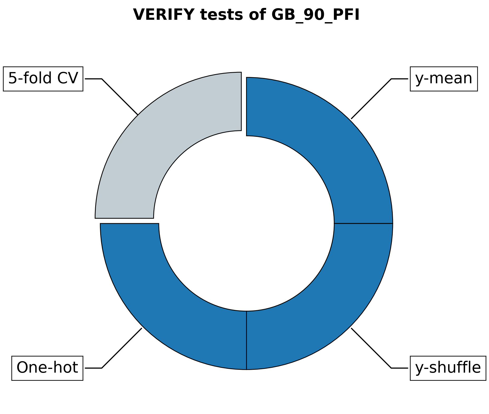

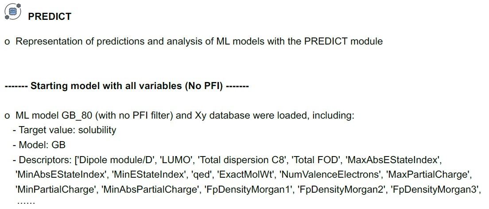

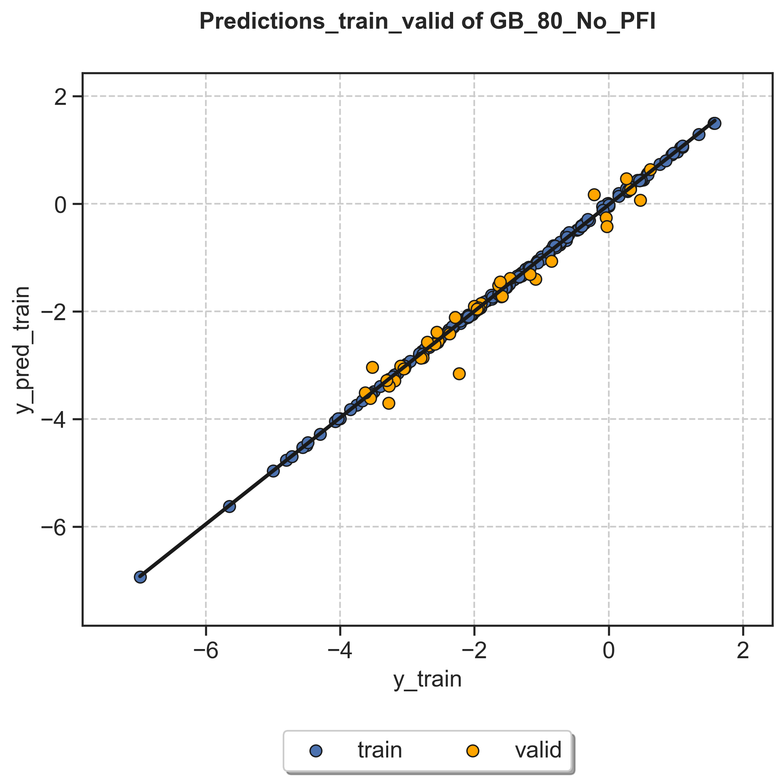

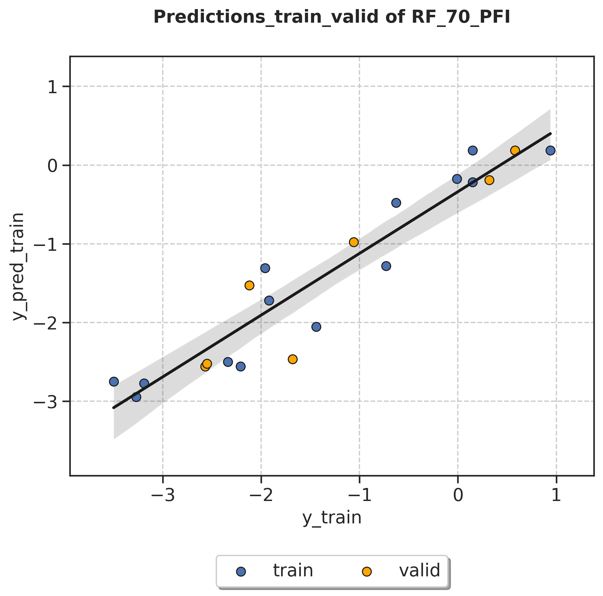

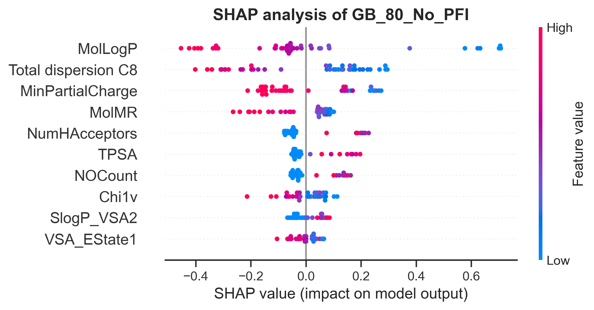

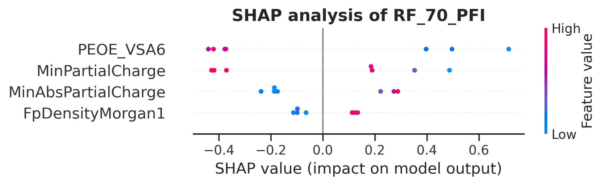

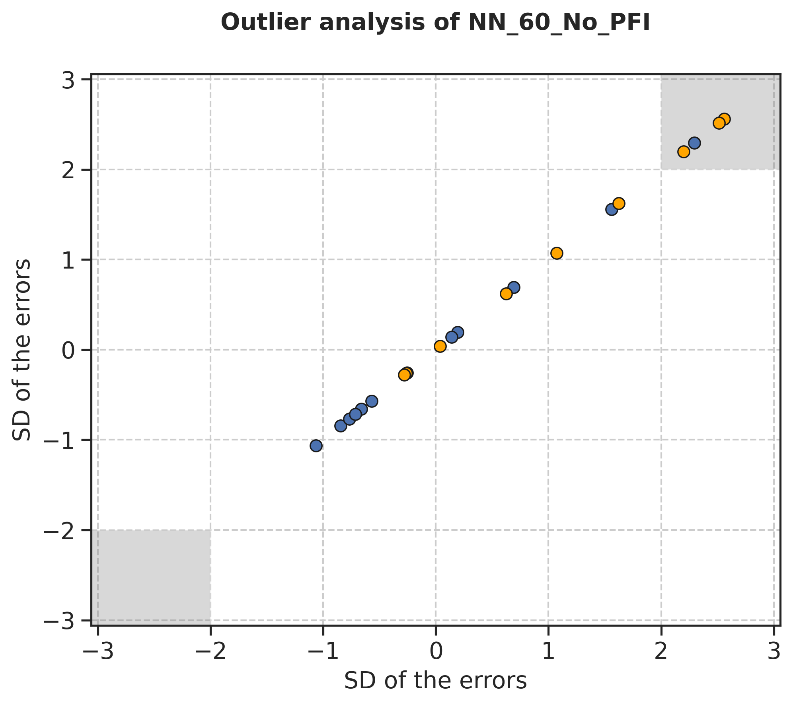

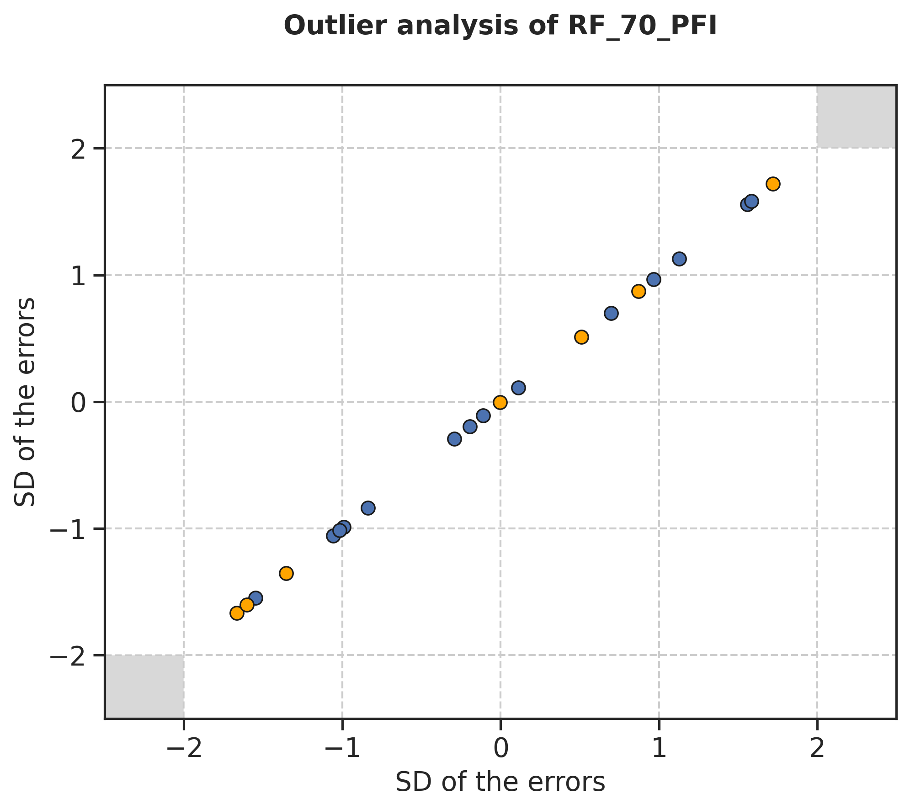

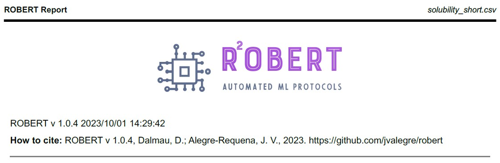

+---------------------------------------------------------------------------------------------------+
|                         .. centered:: **RESULTS**                                                 |
+---------------------------------------------------------------------------------------------------+
|  |                                                                                                |
|  .. centered:: Header of the PDF report                                                           |
+-------------------------------------------------------------+-------------------------------------+
|  .. centered:: Header                                       |    |header|                         |
+-------------------------------------------------------------+-------------------------------------+
|  |                                                                                                |
|  .. centered:: /AQME folder                                                                       |
+-------------------------------------------------------------+-------------------------------------+
|  .. centered:: AQME_data.dat                                |    |AQME_data|                      |
+-------------------------------------------------------------+-------------------------------------+
|  |                                                                                                |
|  .. centered:: /CURATE folder                                                                     |
+-------------------------------------------------------------+-------------------------------------+
|  .. centered:: CURATE_data.dat                              |    |CURATE_data|                    |
+-------------------------------------------------------------+-------------------------------------+
|  |                                                                                                |
|  .. centered:: /GENERATE folder                                                                   |
+-------------------------------------------------------------+-------------------------------------+
|  .. centered:: GENERATE_data.dat                            |    |GENERATE_data|                  |
+-------------------------------------------------------------+-------------------------------------+
|  .. centered:: Heatmap ML models no                         |    |heatmap_no_pfi|                 |
|  .. centered:: PFI filter.png                               |                                     |
+-------------------------------------------------------------+-------------------------------------+
|  .. centered:: Heatmap ML models with                       |    |heatmap_pfi|                    |
|  .. centered:: PFI filter.png                               |                                     |
+-------------------------------------------------------------+-------------------------------------+
|  |                                                                                                |
|  .. centered:: /VERIFY folder                                                                     |
+-------------------------------------------------------------+-------------------------------------+
|  .. centered:: VERIFY_tests_NN_80_No_PFI.dat                |    |VERIFY_dat_no_pfi|              |
|  .. centered:: *(using 131 descriptors)*                    |                                     |
+-------------------------------------------------------------+-------------------------------------+
|  .. centered:: VERIFY_tests_NN_80_No_PFI.png                |    |VERIFY_no_pfi|                  |
|  .. centered:: *(using 131 descriptors)*                    |                                     |
+-------------------------------------------------------------+-------------------------------------+
|  .. centered:: VERIFY_tests_NN_80_PFI.png                   |    |VERIFY_pfi|                     |
|  .. centered:: *(PFI filter applied, using 3 descriptors)*  |                                     |
+-------------------------------------------------------------+-------------------------------------+
|  |                                                                                                |
|  .. centered:: /PREDICT folder                                                                    |
+-------------------------------------------------------------+-------------------------------------+
|  .. centered:: Results_NN_80_No_PFI.dat                     |    |PREDICT_res_no_pfi|             |
|  .. centered:: *(using 131 descriptors)*                    |                                     |
+-------------------------------------------------------------+-------------------------------------+
|  .. centered:: Results_NN_80_No_PFI.png                     |    |PREDICT_graph_no_pfi|           |
|  .. centered:: *(using 131 descriptors)*                    |                                     |
+-------------------------------------------------------------+-------------------------------------+
|  .. centered:: SHAP_NN_80_No_PFI.png                        |    |PREDICT_shap_no_pfi|            |
|  .. centered:: *(using 131 descriptors)*                    |                                     |
+-------------------------------------------------------------+-------------------------------------+
|  .. centered:: Outliers_NN_80_No_PFI.png                    |    |PREDICT_out_no_pfi|             |
|  .. centered:: *(using 131 descriptors)*                    |                                     |
+-------------------------------------------------------------+-------------------------------------+
|  .. centered:: Results_NN_80_PFI.png                        |    |PREDICT_graph_pfi|              |
|  .. centered:: *(PFI filter applied, using 3 descriptors)*  |                                     |
+-------------------------------------------------------------+-------------------------------------+
|  .. centered:: SHAP_NN_80_PFI.png                           |    |PREDICT_shap_pfi|               |
|  .. centered:: *(PFI filter applied, using 3 descriptors)*  |                                     |
+-------------------------------------------------------------+-------------------------------------+
|  .. centered:: Outliers_NN_80_PFI.png                       |    |PREDICT_out_pfi|                |
|  .. centered:: *(PFI filter applied, using 3 descriptors)*  |                                     |
+-------------------------------------------------------------+-------------------------------------+
