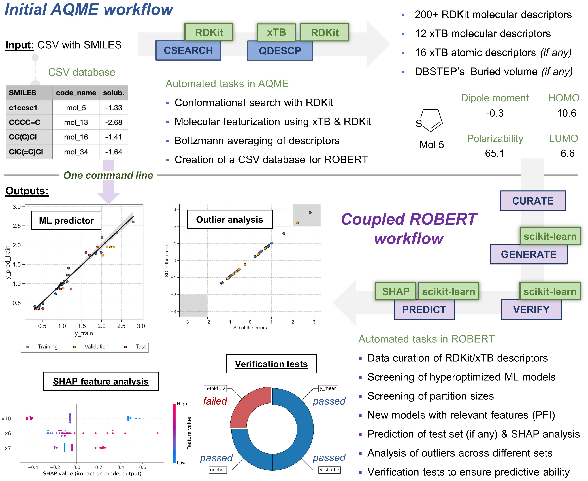
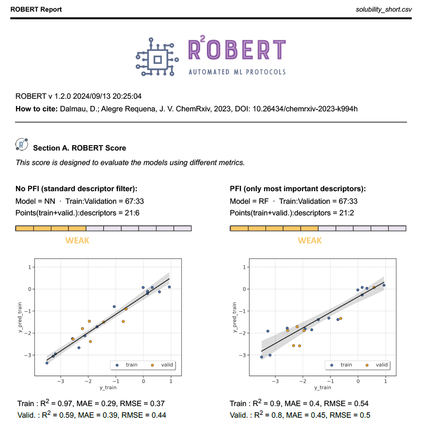

Full workflow from SMILES
=========================

Overview
++++++++

.. centered:: |aqme_fig|

Reproducibility warning
+++++++++++++++++++++++

.. warning::

   **Update to AQME v1.6.0 or higher to obtain fully reproducible results!** You can do it with :code:`pip install aqme --upgrade`.
   Otherwise, it may not be possible to exactly reproduce the results due to subtle differences in the 
   generated xTB descriptors (0.1% changes in most cases).

Required inputs
+++++++++++++++

* **solubility_short.csv:** CSV file with SMILES to generate descriptors that will be used as the training and validation sets. The full CSV file can be found in the `Examples folder of the ROBERT repository <https://github.com/jvalegre/robert/tree/master/Examples/SMILES_workflow>`__ or downloaded here: |csv_smi|

.. |csv_smi| image:: ../images/csv_icon.jpg
   :target: ../../_static/solubility_short.csv
   :width: 30  

.. csv-table:: 
   :file: CSV/solubility_short.csv
   :header-rows: 1
   :widths: 25, 25, 25

The CSV database contains the following columns:

* :code:`code_name`: compound names.  

* :code:`smiles`: SMILES strings of the compounds.  

* :code:`solubility`: solubility of the compounds.  

Required packages
+++++++++++++++++

* **Openbabel:** Install Openbabel with conda-forge:

.. code:: shell

    conda install -y -c conda-forge openbabel=3.1.1

* **AQME:** Install (or update) AQME with conda-forge (or follow the instructions from `their ReadtheDocs <https://aqme.readthedocs.io>`__):

.. code:: shell

    pip install aqme

* **xTB:** Install xTB with conda-forge (or follow the instructions from `their documentation <https://xtb-docs.readthedocs.io>`__):

.. code:: shell

    conda install -y -c conda-forge xtb

.. warning::

  Due to an update in the libgfortran library, **xTB** and **CREST** may encounter issues during optimizations. If you plan to use them, please make sure to run the following command **after** installing them:

.. code-block:: shell 

   conda install conda-forge::libgfortran=14.2.0

Executing the job
+++++++++++++++++

**Instructions:**

1. Install the programs specified in Required packages.
2. Download the **solubility_short.csv** file specified in Required inputs.
3. Go to the folder containing the CSV file in your terminal (using the "cd" command, i.e. :code:`cd C:/Users/test_robert`).
4. Activate the conda environment where ROBERT was installed (:code:`conda activate robert`).
5. Run the following command line:

.. code:: shell

    python -m robert --aqme --y solubility --csv_name solubility_short.csv

**Options used:**

* :code:`--aqme`: Calls the AQME module to convert SMILES into RDKit and xTB descriptors, retrieving a new CSV database. 

* :code:`--y solubility`: Name of the column containing the response y values.  

* :code:`--csv_name solubility_short.csv`: CSV with the SMILES strings.  

By default, the workflow sets:

* :code:`--ignore "[code_name]"` (variables ignored in the model)

* :code:`--discard "[smiles]"` (variables discarded after descriptor generation)

* :code:`--names code_name` (name of the column containing the names of the datapoints)  

Execution time and versions
+++++++++++++++++++++++++++

Time: ~1.5 min

System: 4 processors (Intel Xeon Ice Lake 8352Y) using 8.0 GB RAM memory

ROBERT version: 1.2.0

scikit-learn-intelex version: 2024.5.0

AQME version: 1.6.1

xTB version: 6.6.1

Results
+++++++

**Initial AQME workflow**

.. |csv_report_smi| image:: ../images/csv_icon.jpg
   :target: ../../_static/AQME-ROBERT_solubility_short.csv
   :width: 30

* The workflow starts with a CSEARCH-RDKit conformer sampling (using RDKit by default, although CREST is also available if :code:`--csearch_keywords "--program crest"` is added).

* Then, QDESCP is used to generate more than 200 RDKit and xTB Boltzmann-averaged molecular descriptors (using xTB geometry optimizations and different single-point calculations).

A CSV file called **AQME-ROBERT_solubility_short.csv** should be created in the folder where ROBERT was executed. The CSV 
file can be downloaded here: |csv_report_smi|

**Following ROBERT workflow**

.. |pdf_report_smiles| image:: ../images/pdf_icon.jpg
   :target: ../../_static/ROBERT_report_smiles.pdf
   :width: 30

A PDF file called **ROBERT_report.pdf** should be created in the folder where ROBERT was executed. The PDF 
file can be visualized here: |pdf_report_smiles|

The PDF report contains all the results of the workflow. In this case, two Random Forest (RF) models with 70% training sizes were the optimal models found from: 

  * Four different models (Gradient Boosting GB, MultiVariate Linear MVL, Neural Network NN, Random Forest RF) 
  * Two different partition sizes (60%, 70%) 

The first part of the PDF file is shown below as a preview:

|pdf_preview|