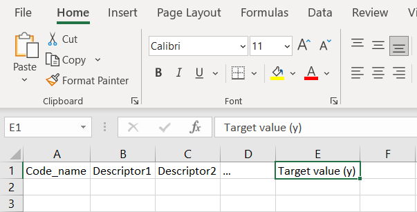
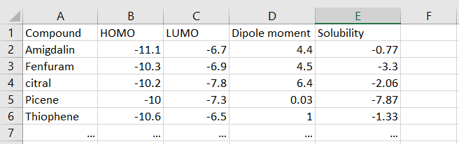
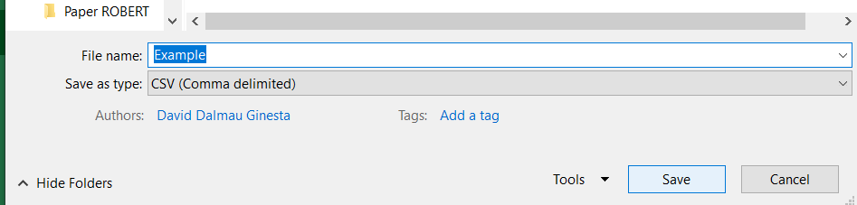
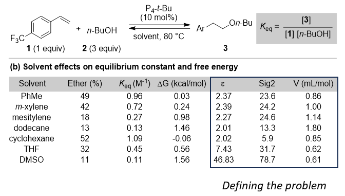
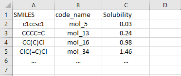

.. database-start

How to create a database
------------------------

CSV file
++++++++

A CSV file, known as a "comma-separated values" file, enables you to store data in a table-structured format. 
Data records are divided by line breaks (i.e., each data record starts a new line). 

.. note:: 

   Creating CSV files is most straightforward when using a spreadsheet application, such as Microsoft Excel.
   

Database generation using Excel
+++++++++++++++++++++++++++++++

*  **Step 1:** Open a new spreadsheet in Microsoft Excel. Any spreadsheet software can be employed to convert data to CSV files.

.. |database1_fig| image:: images/1.png
   :width: 800

.. centered:: |database1_fig|

*  **Step 2:** Specify the headers (one for the names of each data point, one for each descriptor, and one for the target values) in row 1 at the top of the spreadsheet. More information regarding the selection of appropriate descriptors is available in the following section.

.. centered:: |database2_fig|

*  **Step 3:** Enter your data into the spreadsheet under each column as needed. For example, write the compound name in cell A2, the descriptor values in cells B2, C2 and D2, and the target values in cell E2.

.. centered:: |database3_fig|

*  **Step 4:** Go to the "File" tab and select "Save As". Select "CSV" under the "Save as type" dropdown menu and input a title for your CSV file. Then, click the "Save" button to generate your CSV file.

.. centered:: |database5_fig|

Selection of descriptors
++++++++++++++++++++++++

In machine learning, a "descriptor" refers to a specific feature or property of the data used 
to describe or represent an entity. In the context of chemistry, descriptors are characteristics 
of molecules or complexes that are used to define their structures, behaviors, or other relevant 
attributes. There are no strict limitations in defining descriptors, but ideally, descriptors 
should encompass relevant properties that assist machine learning models in differentiating between 
compounds within the database. Descriptors can be specified using experimental measurements (i.e., 
density, melting point, etc.) and theoretical methods (i.e., DFT properties, NBO charges, etc.). 

When creating a database, users have two approaches:

.. |br| raw:: html

    

**1. User-Defined Descriptors**
|br|
Users can utilize their own descriptors, whether obtained experimentally or through computational methods.

**2. Automated: SMILES to Descriptors**
|br|
If users don't have pre-calculated descriptors, they can use the automatic generation of descriptors with the AQME module.

.. |database6_fig| image:: images/6.png
   :width: 800

.. centered:: |database6_fig|

* **User-defined descriptors**

If users want to use descriptors that have been measured or calculated before, they have 
to enter them manually into the database. Researchers can use experimental or 
theoretical descriptors, or a mix of both to define their problem. For example,  
in the article `J. Am. Chem. Soc. 2022, 144, 9586 <https://pubs.acs.org/doi/10.1021/jacs.1c13397>`__, 
the authors wanted to correlate the equilibrium energies (ΔG) obtained with 20 different solvents 
using a machine learning model.

.. centered:: |database7_fig|

In this case, the authors needed to differentiate the solvents using properties/descriptors 
(defining the problem). To achieve this, they constructed a set of 17 molecular descriptors that captured 
electronic and structural differences between the solvents. These descriptors included the 
dielectric constant (ε), the second COSMO σ-moment, which characterizes a molecule's overall electrostatic 
polarity (Sig2), and the McGowan molar volume (V). This is how the database was structured:

.. |database8_fig| image:: images/8.png
   :width: 800

.. centered:: |database8_fig|

* **Automated: SMILES to descriptors**

When users don't have previously measured/calculated descriptors, they can employ AQME to generate 
molecular and atomic descriptors. Let's consider the article 
`J. Chem. Inf. Comput. Sci. 2004, 44, 1000 <https://pubs.acs.org/doi/10.1021/ci034243x>`__, 
which includes a database with SMILES strings and aqueous solubility values in its electronic supporting 
information. A solubility predictor can be developed using this database, as it includes 
columns with the names of the molecules, SMILES strings of the molecules, and the property to be 
predicted (aqueous solubility in this case). The titles of the first two columns must be adjusted 
to "code_name" and "SMILES", respectively. This is how the database would be structured:

.. centered:: |database9_fig|

ROBERT will then be executed with one command line (see the *From SMILES to predictors* section and the *Full workflow from SMILES* example), 
generating results like these:

.. |database10_fig| image:: images/10.png
   :width: 800

.. centered:: |database10_fig|