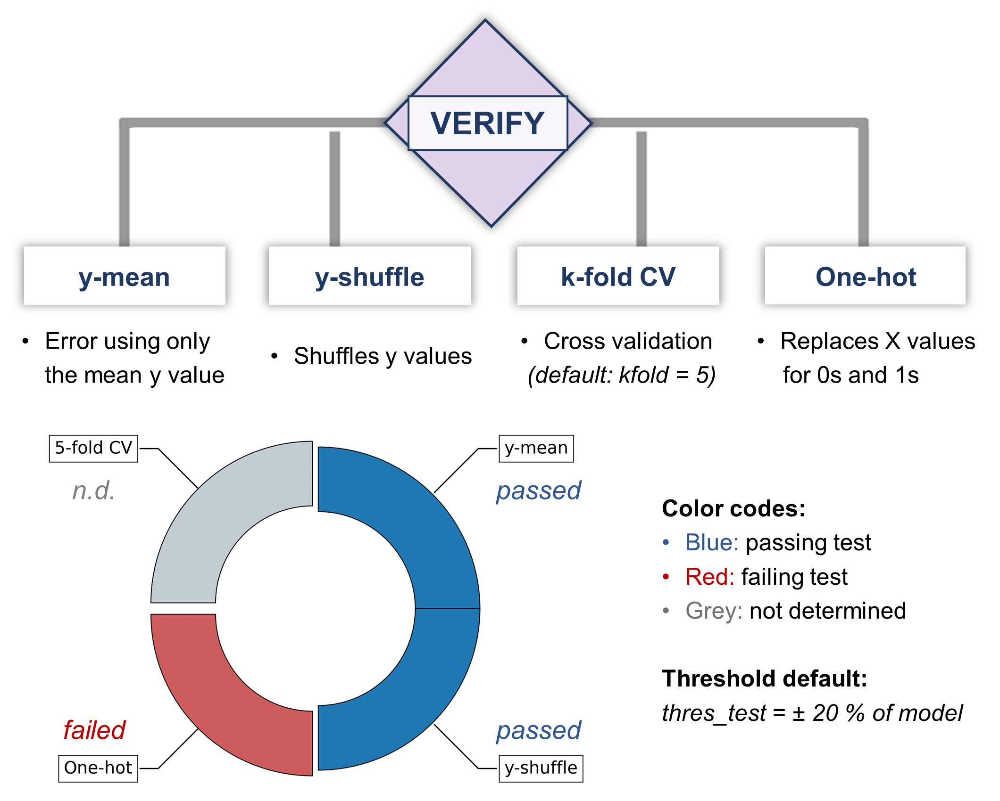

.. verify-modules-start

VERIFY
------

Overview
++++++++

.. centered:: |verify_fig|

Input required
++++++++++++++

This module uses a GENERATE folder created in a GENERATE job.

Automated protocols
+++++++++++++++++++

   *  y-mean test: Calculates the accuracy of the model when all the predicted y values are fixed to the mean of the measured y values (straight line when plotting measured vs predicted y values).  
   *  y-shuffle test: Calculates the accuracy of the model after shuffling randomly all the measured y values.
   *  k-fold CV test: Calculates the accuracy of the model with a k-fold cross-validation. This test is disabled when using k-neighbour-based data splitting (KN, default).
   *  One-hot test: Calculates the accuracy of the model when replacing all descriptors for 0s and 1s. If the x value is 0, the value will be 0, otherwise it will be 1.

Example
+++++++

An example is available in **Examples/Use of individual modules**.

.. verify-modules-end
