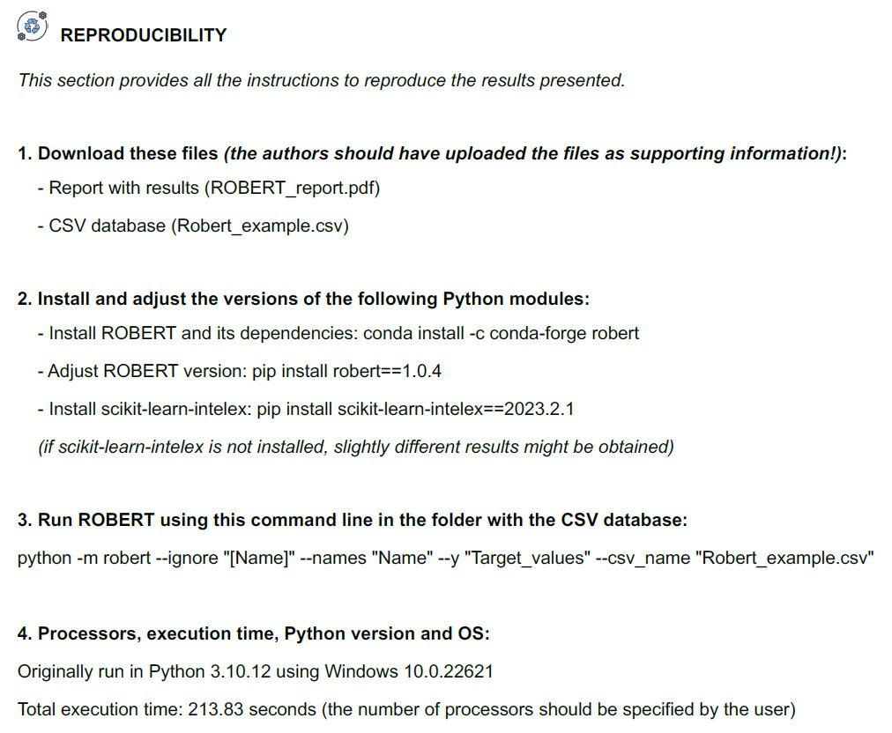
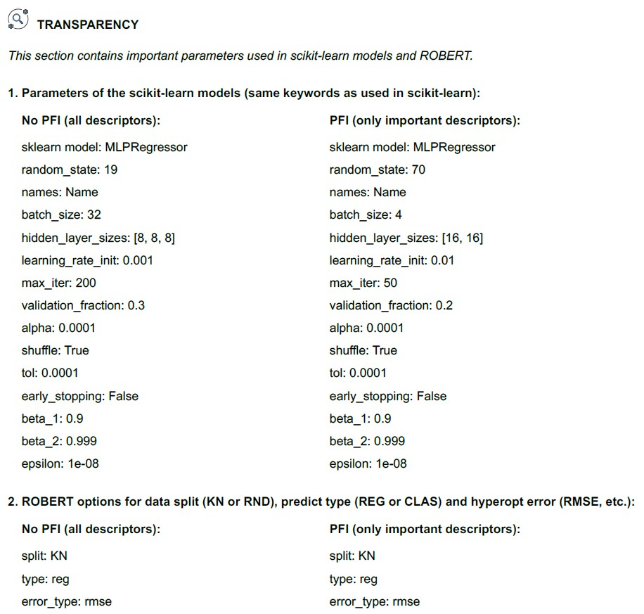

.. robert-repro-start

Reproducibility and Transparency
--------------------------------

Overview
++++++++

ROBERT aims to improve the reproducibility and transparency of chemical machine learning protocols, addressing two long-standing concerns within the scientific community when publishing in peer-reviewed journals. Several authors have emphasized the critical necessity of establishing and enforcing standards in this regard since a significant proportion of publications are challenging or even impossible to replicate (see references below).

The generated ROBERT_report.pdf files include a **reproducibility section** that instructs authors on which files they should upload as supporting information. This section also provides other researchers with the precise programs, versions, and commands required to replicate the results. Additionally, there is a **transparency section** containing comprehensive information about the machine learning models used and other relevant details regarding ROBERT protocols.

* `Best practices in ML for chemistry <https://www.nature.com/articles/s41557-021-00716-z>`__
* `Artificial intelligence faces reproducibility crisis <https://www.science.org/doi/10.1126/science.359.6377.725>`__

Reproducibility section
+++++++++++++++++++++++

This is a screenshot of the reproducibility section shown in the PDF report.

|repro_fig|

Transparency section
++++++++++++++++++++

This is a screenshot of the transparency section shown in the PDF report.

|trans_fig|

.. robert-repro-end
