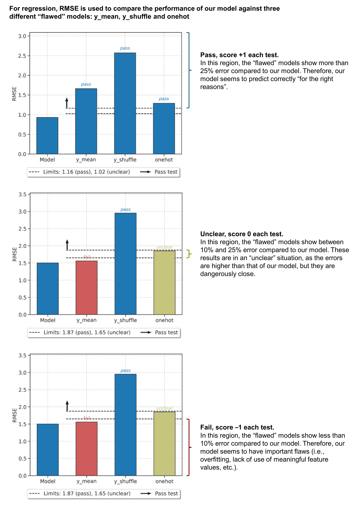
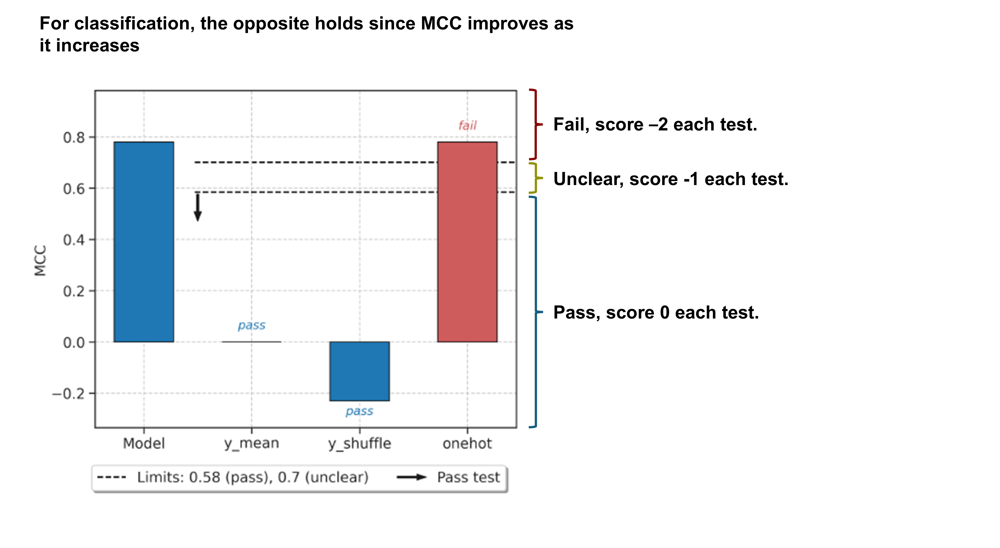
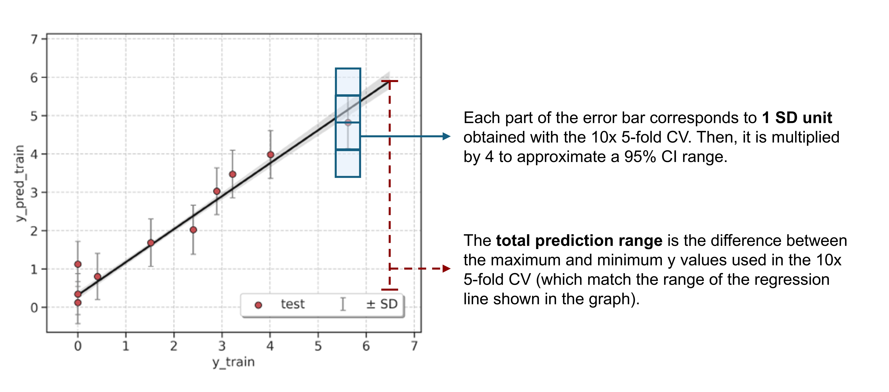
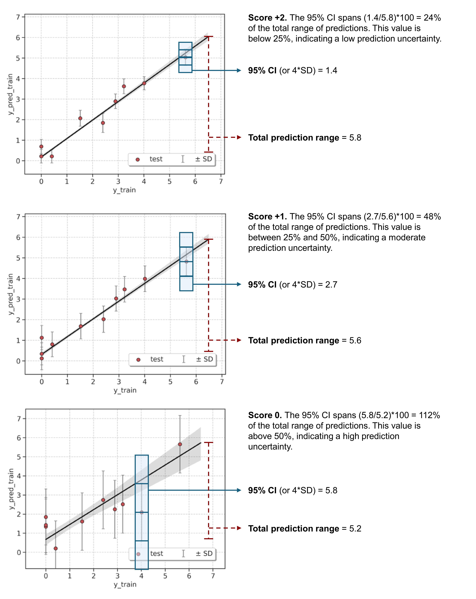

.. robert-score-start

ROBERT score
------------

Overview
++++++++

.. |br| raw:: html

    

While experienced ML users can normally assess whether an ML workflow has yielded favorable results for 
valid reasons, inexperienced users may encounter difficulties in gauging the reliability of its predictive 
proficiency. It is widely recognized that ML algorithms can exhibit good metrics (i.e., R\ :sup:`2`, MAE, RMSE, 
and similar) in the validation set while harboring questionable predictive ability. For example, a user 
might assume that a model with good metrics is proficient at prediction, but that very model could yield 
comparably low errors when the y values are shuffled [1] or when using random numbers as descriptors, [2] 
casting doubt on its actual predictive validity. |br|

For these reasons, we designed the ROBERT score, which is a rating out of 10 designed to provide users 
with insight into the predictive capabilities of the models selected by ROBERT. We attempted to rank the 
models using guidelines aligned with modern ML research (see below). For a more detailed explanation of best practices 
for designing robust ML models, see references [3] and [4].

* [1] `y-Randomization and Its Variants in QSPR/QSAR <https://pubs.acs.org/doi/10.1021/ci700157b>`__
* [2] `Comment on “Predicting reaction performance in C–N cross-coupling using machine learning” <https://www.science.org/doi/10.1126/science.aat8603>`__
* [3] `Best practices in ML for chemistry <https://www.nature.com/articles/s41557-021-00716-z>`__
* [4] `Engineering best practices for ML <https://se-ml.github.io/practices>`__ 

.. note:: 

   Please note that the ROBERT score has been created using insights from 1) prior publications on best practices for ML models, 2) our own experience with such models, and 3) a comprehensive benchmarking process involving the nine examples presented in the ROBERT publication. The scoring ranges were established with the intention of achieving a consensus among the majority of ML experts at the opposite ends of the spectrum (i.e., very weak and strong models), while the intermediate scores (i.e., weak and moderate) might allow for varied interpretations based on differing opinions.
   
   **We are completely open to discuss any advice on how to improve the thresholds used in the score or make the score more robust!**

|br|

How is the score calculated?
++++++++++++++++++++++++++++

**Section B.1. Passing VERIFY tests (from -3 to 3 points):**
^^^^^^^^^^^^^^^^^^^^^^^^^^^^^^^^^^^^^^^^^^^^^^^^^^^^^^^^^^^^

The tests conducted within the VERIFY module are regarded as score indicators:

*  y-mean test: Calculates the accuracy of the model when all the predicted y values are fixed to the mean of the measured y values (straight line when plotting measured vs predicted y values).  
*  y-shuffle test: Calculates the accuracy of the model after shuffling randomly all the measured y values.
*  onehot test: Calculates the accuracy of the model when replacing all descriptors for 0s and 1s. If the x value is 0, the value will be 0, otherwise it will be 1.

The y-mean and y-shuffle tests are valuable in identifying overfitted and underfitted models. 
The one-hot test identifies models that are insensitive to specific values but instead focus 
on the presence of such values (i.e., reaction datasets filled with 0s where compounds are not used).

.. |space| raw:: html

   &nbsp;

============== ================================
Points         Condition
============== ================================
•\ |space| 1   Each of the VERIFY tests passed
0              Each of the unclear VERIFY tests
-•\ |space| -1 Each of the VERIFY tests failed
============== ================================

The following examples might help clarify these points:

|reg_verify|

|clas_verify|

|br|

**Section B.2. Predictive ability towards an external test set (2 points):**
^^^^^^^^^^^^^^^^^^^^^^^^^^^^^^^^^^^^^^^^^^^^^^^^^^^^^^^^^^^^^^^^^^^^^^^^^^^^

The R\ :sup:`2` (for regression) or Matthew's correl. coefficient (MCC, for classification) of an external test set is employed to assess the predictive capabilities of the models found with ROBERT. In cases where a test set is absent, metrics from the validation set are used instead. ROBERT, by default, allocates a sufficient number of data points in test/validation sets to ensure the generation of meaningful R\ :sup:`2`/MCC scores.

============ =======================================================
Points       Condition
============ =======================================================
|br|         **Regression**
•• 2         R\ :sup:`2` > 0.85 (high predictive ability)
•\ |space| 1 0.85 ≥ R\ :sup:`2` ≥ 0.70 (moderate predictive ability)
0            R\ :sup:`2` < 0.70 (low predictive ability)
|br|         **Classification**
•• 2         MCC > 0.75 (high predictive ability)
•\ |space| 1 0.75 ≥ MCC ≥ 0.50 (moderate predictive ability)
0            MCC < 0.50 (low predictive ability)
============ =======================================================

|br|

**Section B.3. Cross-validation (CV) of the model (4 points):**
^^^^^^^^^^^^^^^^^^^^^^^^^^^^^^^^^^^^^^^^^^^^^^^^^^^^^^^^^^^^^^^

The cross-validation tests guarantee the meaningfulness of the chosen data partition and guards against data overfitting. All the tests from this section use a combined dataset with training and validation sets.

.. |u| raw:: html

   <u>

.. |/u| raw:: html

   </u>

|u| Section B.3a. CV predictions from training and validation (2 points) |/u|

Calculates the metrics of the model with a leave-one-out CV (LOOCV, for databases with less than 50 points) or a 5-fold cross-validation (larger databases). The predictions are shown in a graph.

============ =======================================================
Points       Condition
============ =======================================================
|br|         **Regression**
•• 2         R\ :sup:`2` > 0.85 (high predictive ability)
•\ |space| 1 0.85 ≥ R\ :sup:`2` ≥ 0.70 (moderate predictive ability)
0            R\ :sup:`2` < 0.70 (low predictive ability)
|br|         **Classification**
•• 2         MCC > 0.75 (high predictive ability)
•\ |space| 1 0.75 ≥ MCC ≥ 0.50 (moderate predictive ability)
0            MCC < 0.50 (low predictive ability)
============ =======================================================

|u| Section B.3b. Uncertainty of the model (2 points) |/u|

**Regression**

Calculates the uncertainty of the model using MAPIE with a Jackknife+ CV (analogous to LOCCV, for databases with less than 50 points) or a 5-fold CV+ (larger databases). ROBERT then calculates an averaged SD using the SD of all the predictions, then multiplies it by 4 to approximate the 95% confidence interval (CI) of a normally distributed population. The score obtained depends on the uncertainty of the MAPIE results, measured by the width of the 95% CI across the range of y values.

============ ======================================================================
Points       Condition
============ ======================================================================
•• 2         95% CI (or 4*SD) spans less than 25% of the y range (low uncertainty)
•\ |space| 1 95% CI spans between 25% and 50% of the y range (moderate uncertainty)
0            95% CI spans more than 50% of the y range (high uncertainty)
============ ======================================================================

The following examples might help clarify these points:

|sd_explain|

|sd_examples|

**Classification**

Calculates the model's uncertainty by comparing the MCC obtained from the model with the MCC of the CV from Section 3a.

============ ==============================================
Points       Condition
============ ==============================================
•• 2         MCC difference (ΔMCC) < 0.15 (low uncertainty)
•\ |space| 1 0.15 ≤ ΔMCC ≤ 0.30 (moderate uncertainty)
0            ΔMCC > 0.30 (high uncertainty)
============ ==============================================

|br|

**Section B.4. Proportion of datapoints vs descriptors (1 point):**
^^^^^^^^^^^^^^^^^^^^^^^^^^^^^^^^^^^^^^^^^^^^^^^^^^^^^^^^^^^^^^^^^^^

The ratio of datapoints to descriptors of the model (in the train and validation sets) stands as another crucial parameter. Lower ratios result in simpler models that are more human-interpretable. The extensive literature on ML modeling offers numerous suggested ratios, and we endeavored to select a reasonable threshold in accordance with previous recommendations.

============ ==============================================================
Points       Condition
============ ==============================================================
•\ |space| 1 Ratio datapoints:descriptors ≥ 5:1 (low amount of descriptors)
0            Ratio < 5:1 (potentially, too many descriptors)
============ ==============================================================

|br|

Score ranges
++++++++++++

Some of the most common reasons for getting low scores are:

* Unbalanced datasets (i.e., too many points in a region, too few in others)
* Including too few datapoints
* Including too few descriptors
* Overfitted and underfitted models

Different causes that might be affecting your score are included in the ROBERT score section of the PDF report.

**Very weak models:** very unreliable models. 

|veryweak_fig|

**Weak models:** unreliable models. 

.. |weak_fig| image:: images/score_weak.jpg
   :width: 400

|weak_fig|

**Moderate models:** somewhat reliable models. 

.. |moderate_fig| image:: images/score_moderate.jpg
   :width: 400

|moderate_fig|

**Strong models:** reliable models. 

|strong_fig|

.. robert-score-end
