.. robert-score-start

ROBERT score
------------

Overview
++++++++

.. |br| raw:: html

    

While experienced ML users can normally assess whether an ML workflow has yielded favorable results for 
valid reasons, inexperienced users may encounter difficulties in gauging the reliability of its predictive 
proficiency. It is widely recognized that ML algorithms can exhibit good metrics (i.e., R\ :sup:`2`, MAE, RMSE, 
and similar) in the validation set while harboring questionable predictive ability. For example, a user 
might assume that a model with good metrics is proficient at prediction, but that very model could yield 
comparably low errors when the y values are shuffled [1] or when using random numbers as descriptors, [2] 
casting doubt on its actual predictive validity. |br|

For these reasons, we designed the ROBERT score, which reports **two independent ratings out of 10** to give
users insight into the predictive capabilities of the models selected by ROBERT:

* **Interpolation:** how reliably the model predicts within the range of data it was trained on.
* **Boundary robustness:** how well the model holds up at the edges of that range and on the most
  descriptor-wise unusual points, where predictions are hardest to trust.

Both scores are computed from the same battery of VERIFY/PREDICT tests, but each focuses on a different
failure mode, so a model can score very differently on each of them (e.g., a model that interpolates well
but degrades sharply for extreme substrates). We attempted to rank the models using guidelines aligned with
modern ML research (see below). For a more detailed explanation of best practices for designing robust ML
models, see references [3] and [4].

* [1] `y-Randomization and Its Variants in QSPR/QSAR <https://pubs.acs.org/doi/10.1021/ci700157b>`__
* [2] `Comment on “Predicting reaction performance in C–N cross-coupling using machine learning” <https://www.science.org/doi/10.1126/science.aat8603>`__
* [3] `Best practices in ML for chemistry <https://www.nature.com/articles/s41557-021-00716-z>`__
* [4] `Engineering best practices for ML <https://se-ml.github.io/practices>`__ 

.. note:: 

   Please note that the ROBERT score was developed based on the following:
   
   1) insights from previous publications on best practices for ML models;
   2) our experience with these models; and
   3) a comprehensive benchmarking process that involved the nine examples presented in the ROBERT publication (DOI: https://doi.org/10.1002/wcms.1733) along with eight additional examples from low-data regimes (DOI: https://doi.org/10.1039/D5SC00996K).
   
   The scoring ranges were established to achieve consensus among ML experts at the extremes (i.e., very weak and strong models), while allowing for varied interpretations of the intermediate scores (i.e., weak and moderate).

   **We are completely open to discuss any advice on how to improve the thresholds used in the score or make the score more robust!**

   This calibration assumes the standard ``--test_set`` split (~20% of the data held out as a
   test set). If a run uses a custom ``--test_set`` value (including 0, i.e. no held-out test
   set at all), the score isn't meaningful and is hidden from the PDF report — the rest of the
   report (feature importances, outlier analysis, reproducibility, etc.) is unaffected. Using an
   external ``--csv_test`` set does not affect this: it doesn't replace the internal test split
   (which keeps working as usual) and is only used for predicting the extra points it contains,
   which may not even have known target values.

|br|

How is the score calculated?
++++++++++++++++++++++++++++

.. |u| raw:: html

   <u>

.. |/u| raw:: html

   </u>

.. |space| raw:: html

   &nbsp;

Interpolation (0 to 10)
^^^^^^^^^^^^^^^^^^^^^^^^

**Section B.1. Model vs "flawed" models (from -8 to 0 points for regression, -6 to 0 for
classification):**

The tests conducted within the VERIFY module are regarded as score indicators:

*  y-mean test: Calculates the accuracy of the model when all the predicted y values are fixed to the mean of the measured y values (straight line when plotting measured vs predicted y values).
*  y-shuffle test: Calculates the accuracy of the model after shuffling randomly all the measured y values.
*  onehot test: Calculates the accuracy of the model when replacing all descriptors for 0s and 1s. Continuous descriptors are binarized using their own median as the cutoff (value ≥ median → 1, otherwise → 0), while descriptors that are already binary are left untouched.
*  cluster test (regression only): Calculates the accuracy of a trivial baseline that splits the descriptors (X) into two groups with k-means and predicts each point using its own group's average y value. This flags datasets that are really just two separated point clouds, where a model can look deceptively good while only having learned "which group is this point in." This baseline's own prediction (a cluster's mean y) isn't a valid class label, so it doesn't carry over to classification as-is - it's shown as N/A there instead of being scored.

The y-mean and y-shuffle tests are valuable in identifying overfitted and underfitted models.
The one-hot test identifies models that are insensitive to specific values but instead focus
on the presence of such values (i.e., reaction datasets filled with 0s where compounds are not used).
The cluster test identifies models that succeed only by exploiting a coarse split in descriptor space
rather than a genuine structure-property relationship.

============== ========================================================
Points         Condition
============== ========================================================
0               Each of the VERIFY tests passed (4 for regression, 3 for classification)
-• -1           Each of the unclear VERIFY tests
-••  -2         Each of the VERIFY tests failed
============== ========================================================

The following examples might help clarify these points:

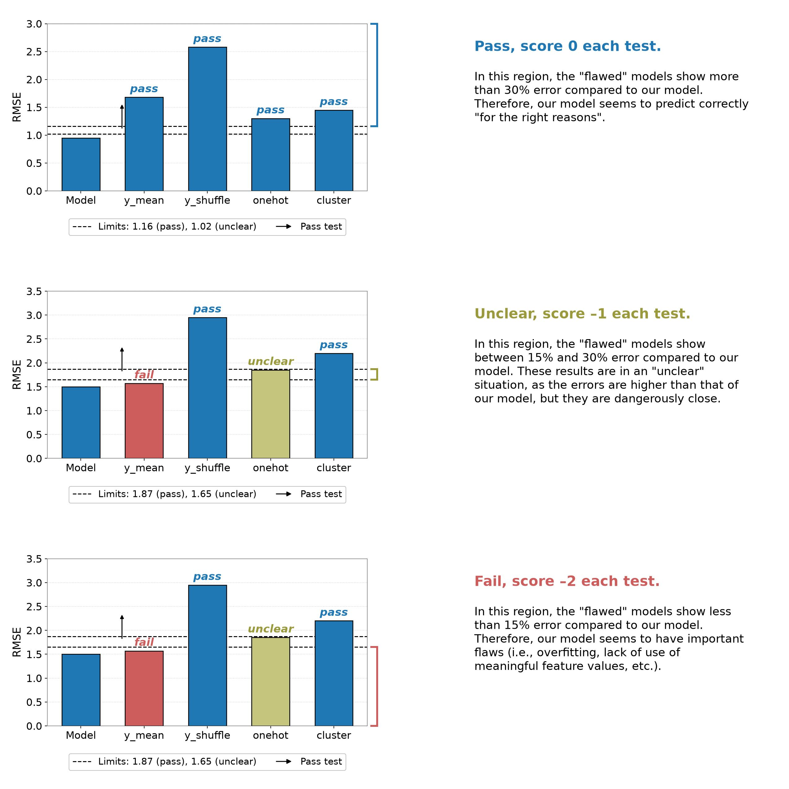

|reg_verify|

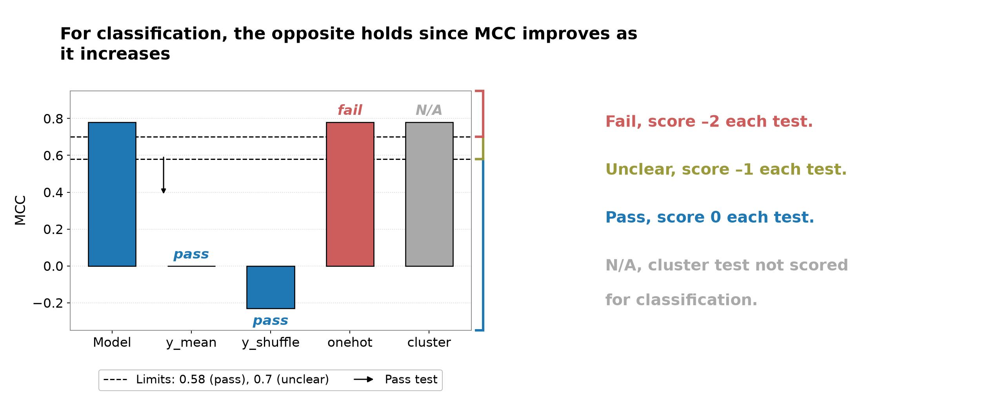

|clas_verify|

|br|

**Section B.2. CV predictions of the model (2 points):**

In regression, two metrics (RMSE and R\ :sup:`2`) are used to ensure a more robust assessment, as a model may show low R\ :sup:`2` while maintaining an acceptable RMSE. In classification, points are assigned based on the MCC, on the same 0-2 scale as regression.

============ =======================================================
Points       Scaled RMSE
============ =======================================================
|br|         **Regression**
•• 2         ≤ 10% (high predictive ability)
•\ |space| 1 ≤ 20% (moderate predictive ability)
0            > 20% (low predictive ability)
|br|         **Classification**
•• 2         MCC > 0.60 (high predictive ability)
•\ |space| 1 0.60 ≥ MCC ≥ 0.30 (moderate predictive ability)
0            MCC < 0.30 (low predictive ability)
============ =======================================================

============ =======================================================
Points        R\ :sup:`2` (penalty)
============ =======================================================
|br|         **Regression**
-•• -2          R\ :sup:`2` < 0.5
-• -1           R\ :sup:`2` < 0.7
0               R\ :sup:`2` >= 0.70
============ =======================================================

|br|

**Section B.3. Test set, generalization and stability (up to 8 points for both regression and classification):**

All the tests from this section use a combined dataset with training and validation sets. B.3a-B.3d all apply
to both prediction types, using an MCC-based definition for classification wherever regression would
otherwise use RMSE/y-range.

|u| Section B.3a. Predictions test set (2 points) |/u|

In regression, two metrics (RMSE and R\ :sup:`2`) are used to ensure a more robust assessment, as a model may show low R\ :sup:`2` while maintaining an acceptable RMSE. In classification, points are assigned based on the MCC, on the same 0-2 scale as regression.

============ =======================================================
Points       Scaled RMSE
============ =======================================================
|br|         **Regression**
•• 2         ≤ 10% (high predictive ability)
•\ |space| 1 ≤ 20% (moderate predictive ability)
0            > 20% (low predictive ability)
|br|         **Classification**
•• 2         MCC > 0.60 (high predictive ability)
•\ |space| 1 0.60 ≥ MCC ≥ 0.30 (moderate predictive ability)
0            MCC < 0.30 (low predictive ability)
============ =======================================================

============ =======================================================
Points        R\ :sup:`2` (penalty)
============ =======================================================
|br|         **Regression**
-•• -2          R\ :sup:`2` < 0.5
-• -1           R\ :sup:`2` < 0.7
0               R\ :sup:`2` >= 0.70
============ =======================================================

|u| Section B.3b. Train vs validation gap (2 points) |/u|

**Regression**

Compares each fold's out-of-fold validation RMSE with that same fold's own in-fold training RMSE, to
catch a model that fits its training folds much better than it generalizes to their held-out validation
fold — a classic sign of overfitting that the CV-average metrics in B.2 can otherwise hide.

============== ======================================================
Points         Scaled RMSE ratio
============== ======================================================
•• 2            Validation RMSE ≤ 1.25*train RMSE
•\ |space| 1    Validation RMSE ≤ 1.50*train RMSE
0               Validation RMSE > 1.50*train RMSE
============== ======================================================

**Classification**

Same idea, expressed as a ΔMCC instead of an RMSE ratio (a discrete label has no RMSE): compares the
in-fold training MCC against the out-of-fold CV MCC from Section B.2, using the same ΔMCC thresholds as
B.3c below.

============ ==============================================
Points       Condition
============ ==============================================
•• 2         MCC difference (ΔMCC) < 0.15 (low overfitting)
•\ |space| 1 0.15 ≤ ΔMCC ≤ 0.30 (moderate overfitting)
0            ΔMCC > 0.30 (high overfitting)
============ ==============================================

|u| Section B.3c. CV vs test consistency (2 points, or MCC difference for classification) |/u|

**Regression**

Differences in scaled RMSE between CV predictions of the model and Predictions test set.

============== ================================
Points         Scaled RMSE ratio
============== ================================
•• 2            Scaled RMSE (test) ≤ 1.25*scaled RMSE (CV)
•\ |space| 1    Scaled RMSE (test) ≤ 1.50*scaled RMSE (CV)
0               Scaled RMSE (test) >1.50*scaled RMSE (CV)
============== ================================

**Classification**

Calculates the model's uncertainty by comparing the MCC obtained from the model with the MCC of the CV from Section 3a.

============ ==============================================
Points       Condition
============ ==============================================
•• 2         MCC difference (ΔMCC) < 0.15 (low uncertainty)
•\ |space| 1 0.15 ≤ ΔMCC ≤ 0.30 (moderate uncertainty)
0            ΔMCC > 0.30 (high uncertainty)
============ ==============================================

|u| Section B.3d. Prediction stability (2 points) |/u|

**Regression**

The model's uncertainty is estimated from the 10 repetitions of the 10x 5-fold CV, combining three facets
of stability into one averaged, rounded score:

*  **(a) Test-set stability:** SD of the repeated-CV predictions on the test set, ×4 to approximate a 95% CI, as a percentage of the y range.
*  **(b) Train/validation stability:** the same SD-based check, computed instead on the out-of-fold train+validation predictions.
*  **(c) RMSE stability:** the coefficient of variation (SD / mean) of the aggregate RMSE across the 10 CV repeats.

============ ======================================================================
Points       Condition — facets (a) and (b)
============ ======================================================================
•• 2         95% CI (or 4*SD) spans less than 25% of the y range (low uncertainty)
•\ |space| 1 95% CI spans between 25% and 50% of the y range (moderate uncertainty)
0            95% CI spans more than 50% of the y range (high uncertainty)
============ ======================================================================

============ ======================================================================
Points       Condition — facet (c)
============ ======================================================================
•• 2         RMSE coefficient of variation ≤ 15%
•\ |space| 1 RMSE coefficient of variation ≤ 25%
0            RMSE coefficient of variation > 25%
============ ======================================================================

The final score for this item is the average of (a), (b) and (c), rounded to the nearest point.

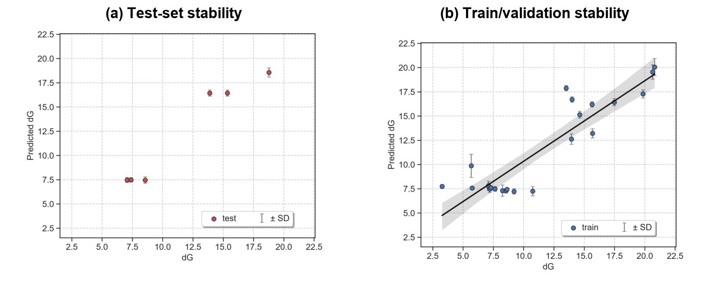

|stability_real|

*Real (a) test-set and (b) train/validation SD plots from an actual ROBERT v2.2.0 report — facet (c),*
*RMSE coefficient of variation, is a single number and isn't plotted.*

The examples below illustrate facet (a), the test-set stability check, in more detail:

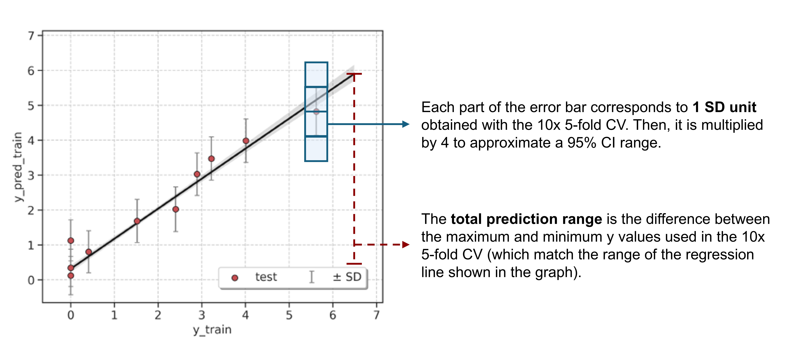

|sd_explain|

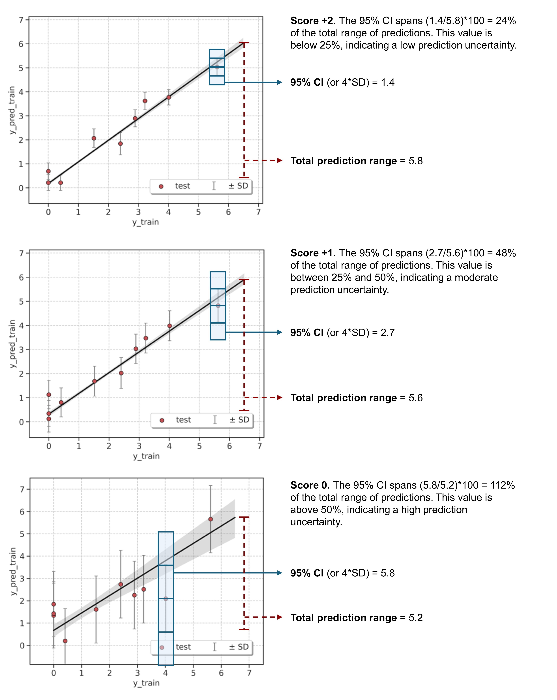

|sd_examples|

**Classification**

The same three facets, adapted for a discrete label instead of a continuous one — computed from the same
repeated-CV predictions, using the majority-voted class already reported in Section B.2/B.3a:

*  **(a) Test-set stability:** disagreement rate between individual CV repeats and the majority-voted class, on the test set.
*  **(b) Train/validation stability:** the same disagreement-rate check, computed on the out-of-fold train+validation predictions.
*  **(c) MCC stability:** the coefficient of variation of the MCC computed separately for each of the 10 CV repeats.

============ ======================================================================
Points       Condition — facets (a), (b) and (c)
============ ======================================================================
•• 2         ≤ 15% (low uncertainty)
•\ |space| 1 ≤ 25% (moderate uncertainty)
0            > 25% (high uncertainty)
============ ======================================================================

The final score is the average of (a), (b) and (c), rounded to the nearest point — the same combination
rule as regression, reusing regression facet (c)'s 15%/25% thresholds directly for all three, since all
three are now plain percentages rather than a percentage of the y-range.

|br|

Boundary robustness (0 to 10 for regression only)
^^^^^^^^^^^^^^^^^^^^^^^^^^^^^^^^^^^^^^^^^^^^^^^^^

Not defined for classification: none of the sub-metrics below have a well-defined discrete-label
equivalent yet, so classification reports show only the Interpolation score (see `Score ranges`_ below).

For regression, ROBERT sorts the dataset by its target value and runs **two independent 80/20 splits**
of it — not one three-way split. The "Low" split holds out the bottom 20% of points as its test fold and
trains on the remaining top 80%; the "High" split holds out the top 20% and trains on the remaining
bottom 80%. Each split is evaluated with its own repeated 5-fold CV over its own 80% training portion, so
a point in the top 80% of one split can be in the held-out 20% of the other. Four of the five sub-metrics
below come from these two extreme folds; the fifth uses a different, X-descriptor space definition of
"boundary" instead.

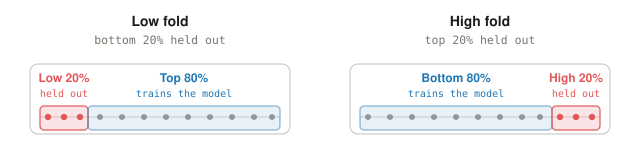

|sorted_lh|

*Not statistical outliers — simply the most extreme 20% of real values in the dataset. Sub-metrics 1-4*
*below all follow this Low/High fold pattern; sub-metric 5 breaks it on purpose (more on that when we*
*get there).*

|u| 1-2. Low / High — scaled RMSE (2 points each) |/u|

============== ================================
Points         Scaled RMSE (Low or High fold)
============== ================================
•• 2            ≤ 10%
•\ |space| 1    ≤ 20%
0               > 20%
============== ================================

Each of these two items also carries a **crossing-rate penalty**, based on the fraction of Low/High
predictions that actually extrapolate past the training range instead of being clipped back into it
(a model that never truly leaves the training range at the boundary is not really being tested there):

============== ================================================
Penalty        Crossing rate (Low or High fold)
============== ================================================
0               ≥ 50% of predictions cross the training boundary
-• -1           < 50% cross the boundary
-•• -2          < 20% cross the boundary
============== ================================================

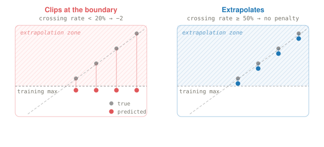

|crossing_diag|

*Same four extreme points, two different model behaviors. "Crossing" is the fraction of Low/High*
*predictions that actually land beyond the training range rather than clipping to it — logged in the*
*PDF as* ``Beyond training range (Low/High)``. *Tree-based models (RF, GB) tend to score poorly here: a*
*decision tree's prediction is always the average of some training leaf, so it structurally cannot*
*predict a value outside the range it was trained on.*

The RMSE score and the crossing penalty are combined and floored at 0, so this item can never go negative.

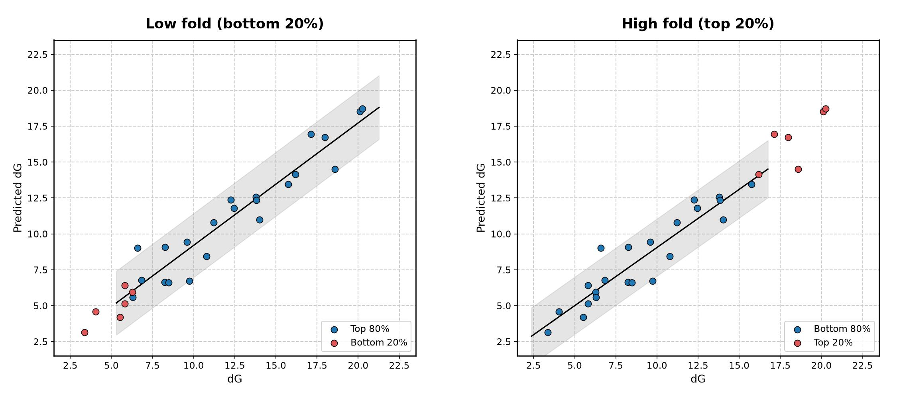

|boundary_lh_real|

*Real Low/High fold scatter plots from an actual ROBERT v2.2.0 report — this is what Section B of the*
*PDF actually shows for sub-metrics 1-2.*

|u| 3. Spearman rank (2 points) |/u|

Spearman rank correlation between measured and predicted y values, computed separately within each
extreme fold, to check that the model still ranks points correctly even where it can't hit them exactly.
A model can be systematically biased at the edges (consistently predicting a bit high or low) and still
be useful if it correctly tells you which of two extreme points is more extreme than the other — getting
the order wrong is a worse sign than getting the scale wrong.

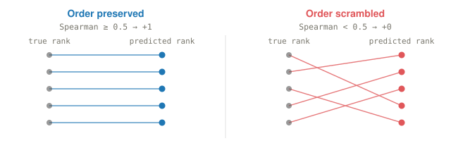

|spearman_diag|

*Parallel lines mean the model's predicted order matches the true order; crossings mean it doesn't.*

============== ================================
Points         Spearman (Low or High fold)
============== ================================
•\ |space| 1    ≥ 0.5
0               < 0.5
============== ================================

|u| 4. Degradation ratio (2 points) |/u|

Compares each extreme fold's scaled RMSE against the RMSE of the *remaining* 80% of the data, so a
model can't hide a badly-degraded boundary behind a fine-looking interior.

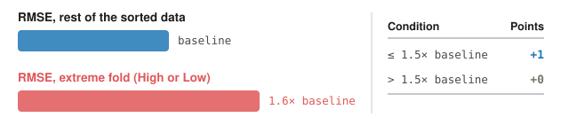

|degrad_diag|

*Reported in the PDF as e.g.* ``Degradation vs 80% RMSE: High 1.65x, Low 1.61x`` *— both sides scored*
*independently against the same 1.5x line, so one badly-degraded side can't hide behind a fine one.*

============== ================================
Points         RMSE vs remaining 80% (Low or High fold)
============== ================================
•\ |space| 1    ≤ 1.5x
0               > 1.5x
============== ================================

|u| 5. Applicability domain (leverage) (2 points) |/u|

Unlike items 1-4, this metric measures robustness in **X-descriptor space** rather than y-space: ROBERT
trains on the 80% "typical" points and tests on the 20% highest-leverage points, using the classical QSAR
statistical leverage (the diagonal of the hat matrix, :math:`h_i = x_i^T (X_{train}^T X_{train})^{-1} x_i`)
to identify which points are the most structurally/descriptor-wise extreme — the same quantity plotted on
a Williams plot, with the usual warning threshold :math:`h^* = 3(p+1)/n`.

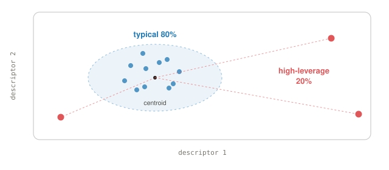

|leverage_diag|

*Leverage looks at X, not y. A point can have a perfectly ordinary target value and still be structurally*
*novel — an unusual combination of descriptors the model has barely seen examples of.*

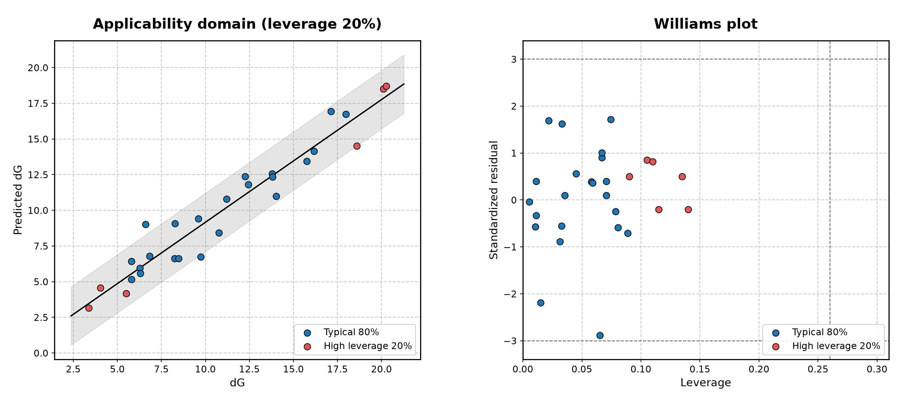

|leverage_real|

*Real output from an actual ROBERT v2.2.0 report: the applicability-domain scatter (left) and the*
*Williams plot itself — leverage on the x-axis, standardized residual on the y-axis, with the*
*h\* threshold marked as a vertical dashed line (right).*

============== ================================
Points         Scaled RMSE (high-leverage 20%)
============== ================================
•• 2            ≤ 10%
•\ |space| 1    ≤ 20%
0               > 20%
============== ================================

Score ranges
++++++++++++

For regression, each of the two scores (Interpolation and Boundary robustness) is rated independently on
the same five-tier scale below — a model can, for example, be a "very strong" interpolator while only
"moderate" at the boundary. For classification, only Interpolation is rated (see above).

Some of the most common reasons for getting low scores are:

* Unbalanced datasets (i.e., too many points in a region, too few in others)
* Including too few datapoints
* Including too few descriptors
* Overfitted and underfitted models

Different causes that might be affecting your score are included in the ROBERT score section of the PDF report.

**Very weak models:** very unreliable models. 

|veryweak_fig|

**Weak models:** unreliable models. 

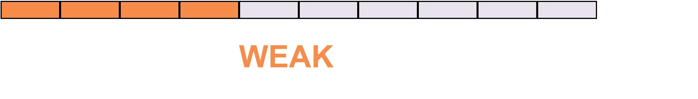

|weak_fig|

**Moderate models:** somewhat reliable models. 

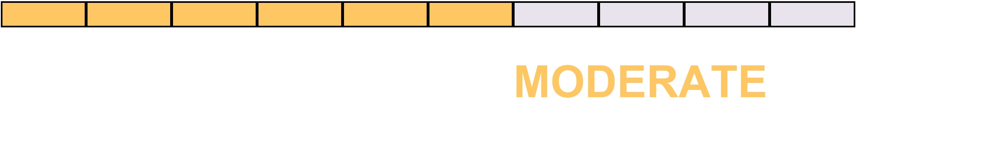

|moderate_fig|

**Strong models:** reliable models.

|strong_fig|

**Very strong models:** highly reliable models.

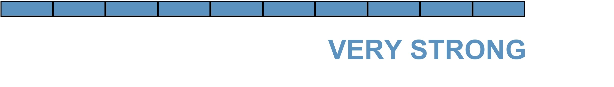

|verystrong_fig|

.. robert-score-end
